# 3. Creative Builds

## 3.25 Smart Weather Bot

### 3.25.1 Introduction

This smart weather robot features environmental sensing capabilities. The large AI model coordinates with sensors to collect environmental data, while the dot matrix display dynamically shows real-time temperature and humidity, making it easy to monitor indoor environmental conditions.

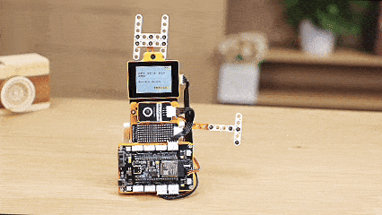

### 3.25.2 Learning Objectives

1. Understand the components of the smart weather robot and master the integration of temperature/humidity sensors, dot matrix displays, and large AI model commands.
2. Learn to switch display modes via large AI model commands, achieving real-time visual feedback of environmental data.

### 3.25.3 Assembly Guide

### 3.25.4 Mode Switching

This model requires the **online large model**. If the online large model mode has already been entered, this step can be skipped to proceed directly to the wiring guide. Otherwise, refer to [4.4.10 Firmware Update]() to re-flash the corresponding firmware.

### 3.25.5 Wiring Guide

Connect the dot matrix module cable to port 6 of the ESP32 controller.

Connect the temperature and humidity sensor cable to port 1 of the ESP32 controller.

Connect the WonderLLM module cable to port 2 of the ESP32 controller.

Connect the 270° block servo cable to port S1 of the ESP32 controller, and insert the orange servo wire into the white pin of S1.

As shown in the diagram:

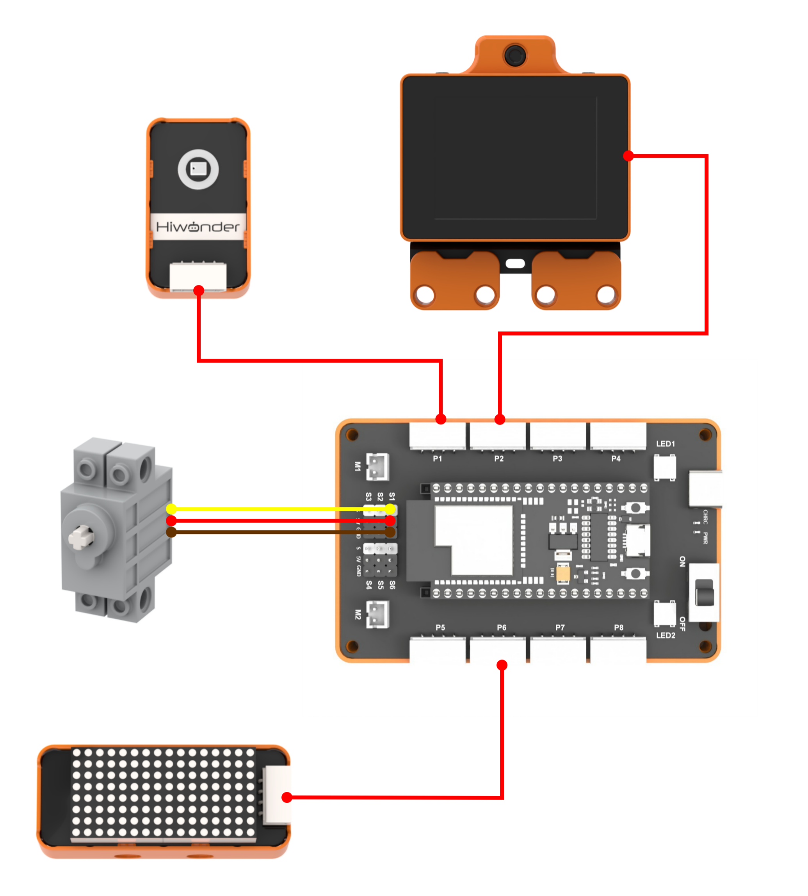

> [!NOTE]
>
> **When conducting a lesson related to the 270° block servo for the first time, remove the gear and its attached building blocks from the 270° servo first, and then upload the following 270° servo reset program to the ESP32 controller. Next, remount the building blocks that were removed, upload the program for this lesson to the ESP32, and wait for the 270° block servo to rotate to its initial position at 135°. This step can be skipped if the servo reset program has been executed previously.**

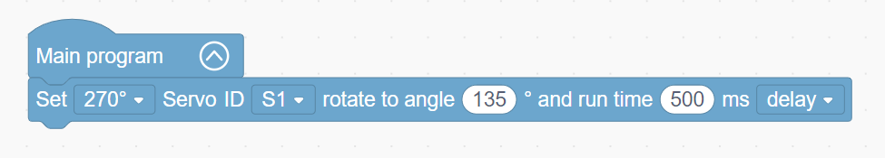

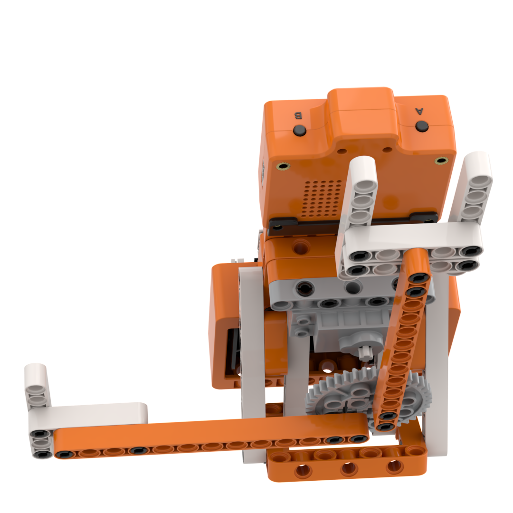

### 3.25.6 Programming

#### (1) Program Concept Diagram

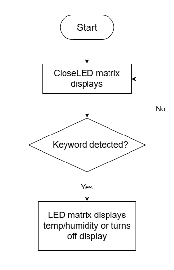

#### (2) Add Extension Libraries

- Select **Sensor** in the **Choose an Extension** interface to add **Temperature and humidity sensor** and **WonderLLM**.

- Select **Output module** in the **Choose an Extension** interface to add **Dot matrix module**.

#### (3) Core Blocks Analysis

| Block | Category | Function Description |
| :---: | :---: | :--- |
|  | 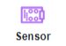 | Send custom text messages to the WonderLLM large model. |
|  |  | Configure MCP tool calling parameters, customize the tool name, description, execution command, and return parameters, and set calling blocking and data return rules. |
|  |  | Turn on or off the mcp switch to control whether WonderLLM enables the custom tool calling capability. |
|  |  | Read the result data returned after the execution of the mcp tool is completed. |
|  |  | Control the conversation message output mode, which can send the action end identifier, and turn on or off the printing output of conversation content. |
| 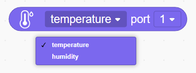 |  | Read the ambient temperature or humidity value collected by the temperature and humidity sensor at the corresponding port. |
|  | 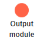 | Control the dot matrix screen to output and display a specified number, with real-time screen value refreshing. |
|  |  | Control the dot matrix screen to load and display preset patterns, allowing custom switching of various graphics and symbol screens. |
|  |  | Adjust the backlight brightness of the dot matrix screen, with a brightness range of 1 to 8, where a larger value indicates a brighter screen. |
|  |  | Control the 270° servo of a specified port to rotate smoothly to the target angle within a set duration, with an automatic delay to wait for the servo to complete the action. |
|  |  | Perform boolean logical judgments, evaluating input conditions for true/false states or applying negation operations. |
|  |  | Customize the entry or invocation of text content to generate string data for concatenation, judgment, and display. |
|  |  | Determine whether a specified element exists in an array, tuple, or dictionary, returning a boolean result. |
|  |  | Extract the corresponding stored value or text content from a dictionary based on a specified key name. |

#### (4) MCP Parameter Configuration

​	**Tool Name: `self.robot.getTemAndHum`**

​	1. Tool Description: You are a temperature and humidity measuring instrument, equipped with a temperature and humidity sensor and a dot matrix module. You can switch between temperature display and humidity display in the dot matrix module. Main parameters: Display temperature and humidity: Display temperature returns 1, display humidity returns 2.

​	2. Command Name: `getTemAndHum`

​	3. **Return Parameters:** `[["display","int","0","0","2"]]` **Note that the first 0 is the default value, the second 0 is the minimum value, and 2 is the maximum value.**

​	4. Block until completion: Yes

​	5. Return data: No

​	6. Function: This MCP configuration defines a temperature and humidity display control tool for the WonderLLM module. It allows WonderLLM to issue 0 to 2 display level commands to switch the temperature and humidity display status of the dot matrix module. The program blocks during the call to wait for the display switch to finish, and no operational data needs to be returned to WonderLLM.

#### (5) Complete Program

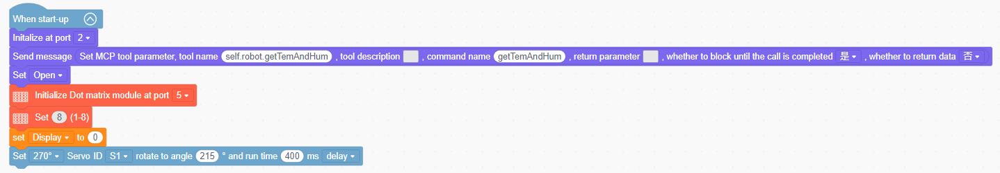

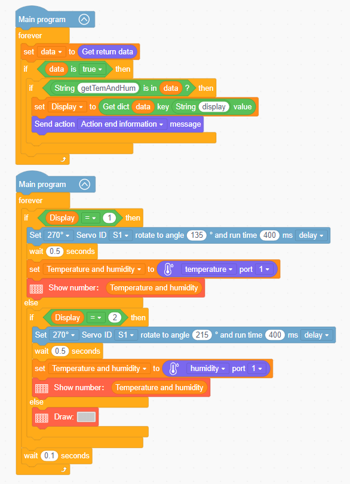

The source files are available for download as a zip archive under [1. Source Code / 02 Program Files for Builds](https://drive.google.com/drive/folders/1guTJsuFCa0f3ZVMcZNNWJ6NruvY7gsUd?usp=sharing).

### 3.25.7 Downloading Programs

### 3.25.8 Project Extensions

After voice-retrieving the temperature and humidity data, the dot matrix display switches expressions based on the environment values: showing a smiley face when conditions are comfortable, and displaying a sad face if the temperature or humidity becomes too high.

### 3.25.9 Technical Support and Discussion

Join the forum for sharing questions, ideas, or suggestions, and answers will be provided promptly. Click the hyperlink [Hiwonder Forum](http://forum.hiwonder.com) or enter the URL in a browser: http://forum.hiwonder.com

## 3.26 Smart Avoidance Car

### 3.26.1 Introduction

This multifunctional robot car features three distinct features integrated into a single vehicle. It can track lines along a black path, automatically navigate around obstacles, and turn freely in response to voice commands, offering a rich and diverse learning experience.

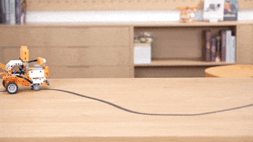

### 3.26.2 Learning Objectives

1. Understand the 4-channel line follower sensor, glowy ultrasonic sensor, 360° block motor, 270° block servo, and WonderLLM module, mastering coordinated control of multiple sensors and actuators.
2. Comprehend the control logic behind line tracking, ultrasonic obstacle avoidance, and voice control, programming conditional statements to switch between different features.

### 3.26.3 Assembly Guide

### 3.26.4 Mode Switching

This model requires the **online large model**. If the online large model mode has already been entered, this step can be skipped to proceed directly to the wiring guide. Otherwise, refer to [4.4.10 Firmware Update]() to re-flash the corresponding firmware.

### 3.26.5 Wiring Guide

Connect the glow ultrasonic sensor cable to port 2 of the controller.

Connect the 4-channel line follower sensor cable to port 3 of the ESP32 controller.

Connect the WonderLLM module cable to port 1 of the ESP32 controller.

Connect the left 360° block servo cable to port S1 of the controller, and insert the orange servo wire into the white pin of S1.

Connect the right 360° block servo cable to port S2 of the controller, and insert the orange servo wire into the white pin of S2.

Connect the 270° block servo cable to port S3 of the ESP32 controller, and insert the orange servo wire into the white pin of S3.

As shown in the diagram:

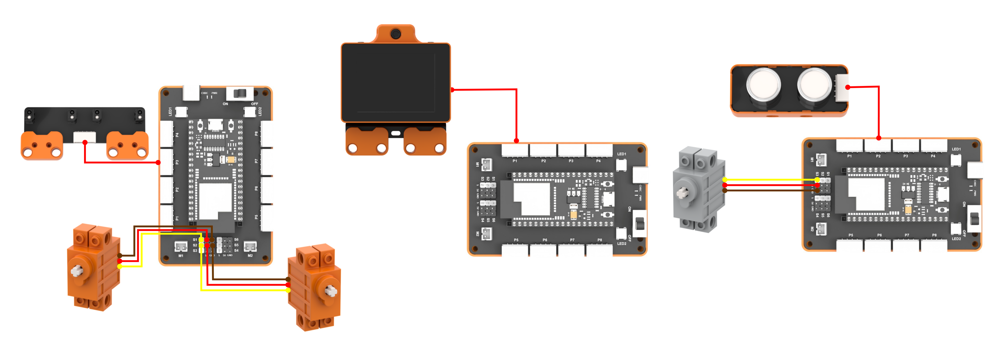

> [!NOTE]
>
> **When conducting a lesson related to the 270° block servo for the first time, remove the gear and its attached building blocks from the 270° servo first, and then upload the following 270° servo reset program to the ESP32 controller. Next, remount the building blocks that were removed, upload the program for this lesson to the ESP32, and wait for the 270° block servo to rotate to its initial position at 135°, making the glow ultrasonic sensor face directly forward. This step can be skipped if the servo reset program has been executed previously.**

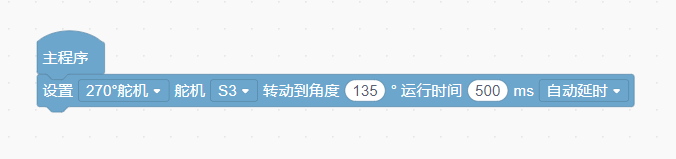

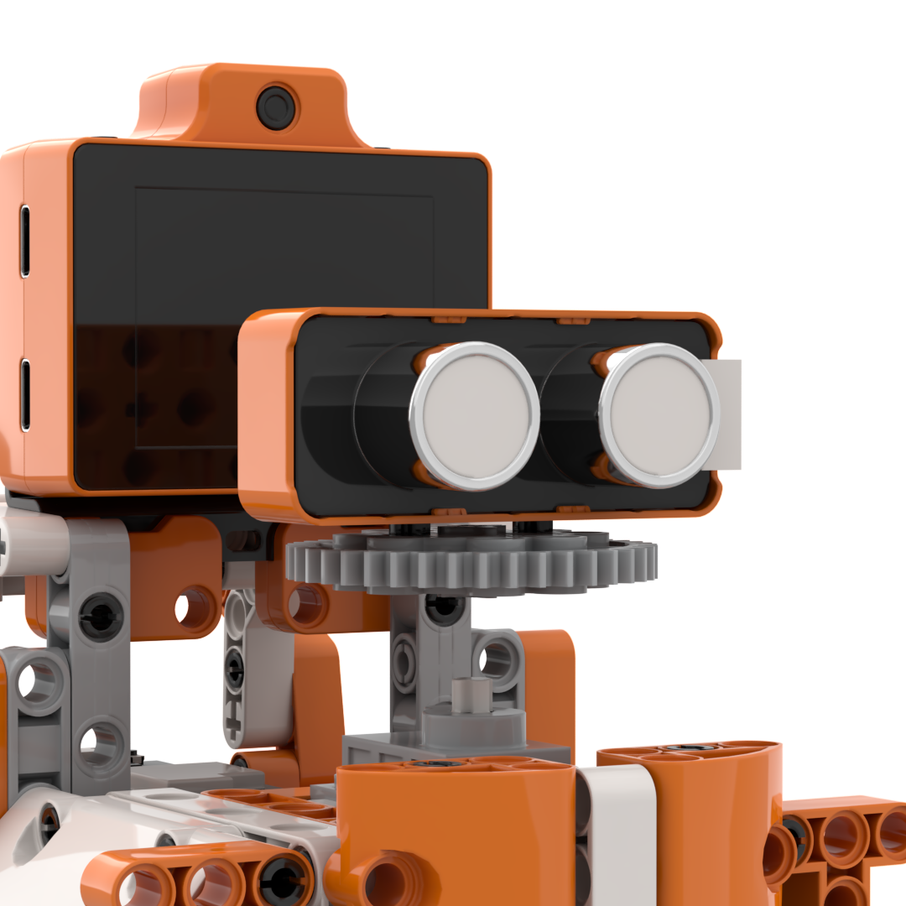

### 3.26.6 Programming

#### 1. Mode 1 Line Following Cruise

##### (1) Program Concept Diagram

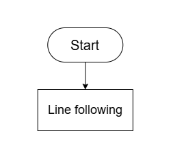

##### (2) Add Extension Libraries

Select **Sensor** in the **Choose an Extension** interface to add **4-channel line follower sensor**.

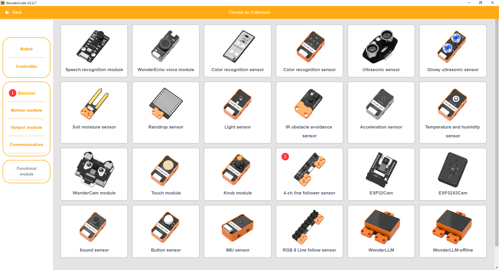

##### (3) Core Blocks Analysis

| Block | Category | Function Description |
| :---: | :---: | :--- |
|  |  | Control the 360° servo of a specified port to rotate continuously at a set custom speed. |
|  |  | Immediately terminate the rotation of the 360° servo at the specified port, bringing the servo to a stop. |
|  |  | Read the black and white ground detection status of the corresponding channel of the 4-channel line follower sensor, returning a boolean value to judge whether the current channel has detected the black line. |

##### (4) Complete Program

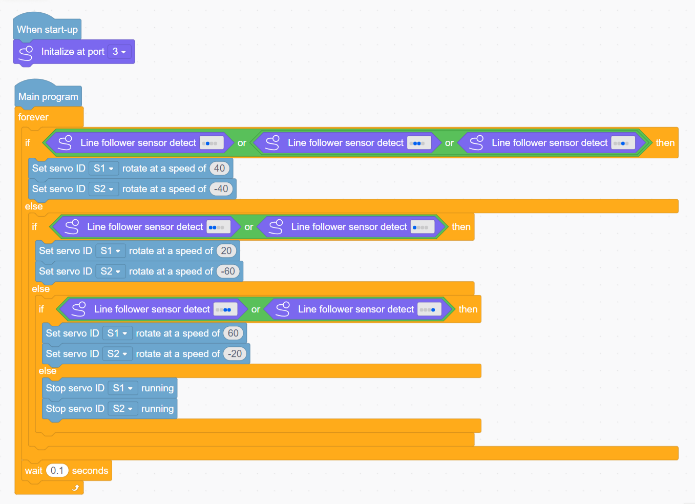

The source files are available for download as a zip archive under [1. Source Code / 02 Program Files for Builds](https://drive.google.com/drive/folders/1guTJsuFCa0f3ZVMcZNNWJ6NruvY7gsUd?usp=sharing).

#### 2. Mode 2 Scanning Obstacle Avoidance

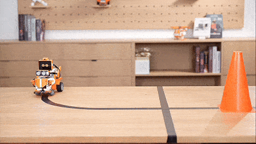

##### (1) Program Concept Diagram

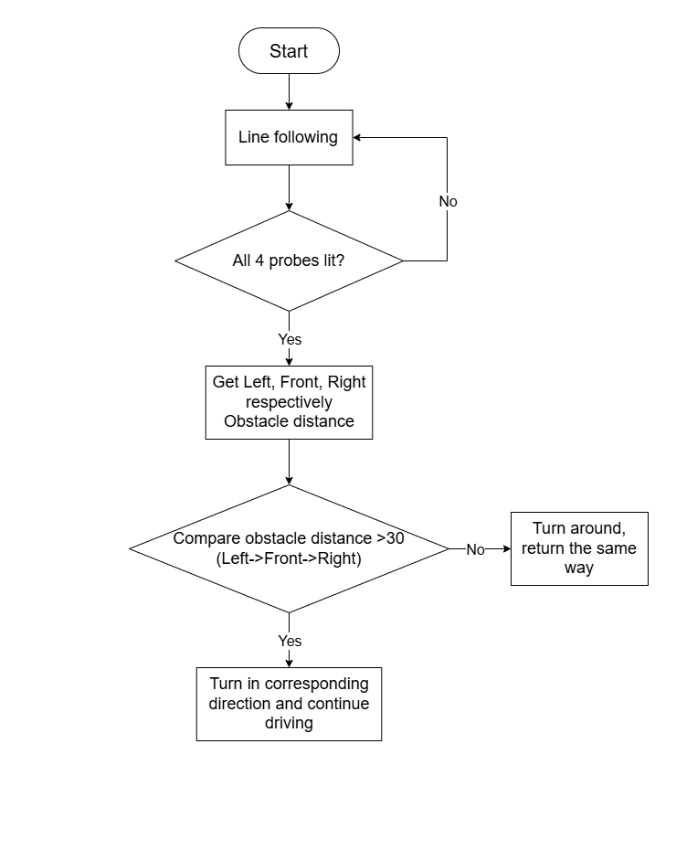

##### (2) Add Extension Libraries

Select **Sensor** in the **Choose an Extension** interface to add **Glowy ultrasonic sensor** and **4-channel line follower sensor**.

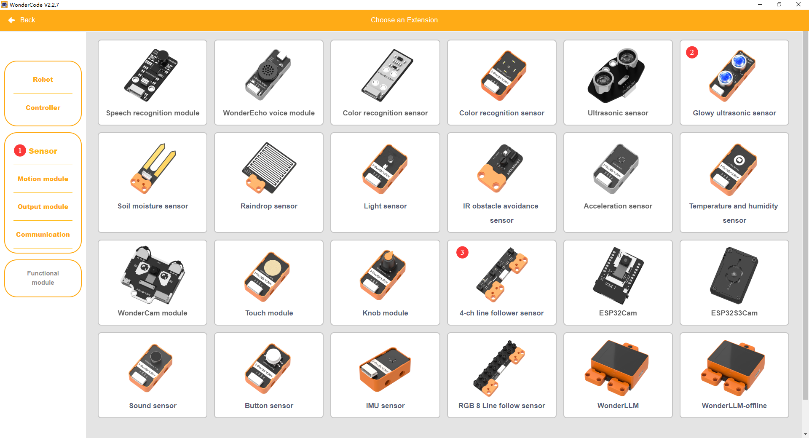

##### (3) Core Blocks Analysis

| Block | Category | Function Description |
| :---: | :---: | :--- |
|  |  | Control the 360° servo of a specified port to rotate continuously at a set custom speed. |
|  |  | Read the black and white ground detection status of the corresponding channel of the 4-channel line follower sensor, returning a boolean value to judge whether the current channel has detected the black line. |
| 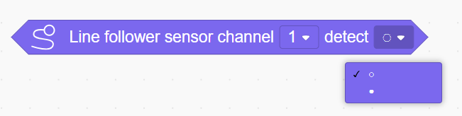 |  | Read the black and white ground detection status of a single channel of the 4-channel line follower sensor, returning a boolean value to judge whether the corresponding channel has detected the black line. |
|  |  | Get the obstacle distance data measured by the ultrasonic sensor in centimeters. |
|  |  | Create a custom function block to encapsulate a segment of reusable program logic. |
|  |  | Call the defined custom function to execute all program logic encapsulated inside it. |

##### (4) Complete Program

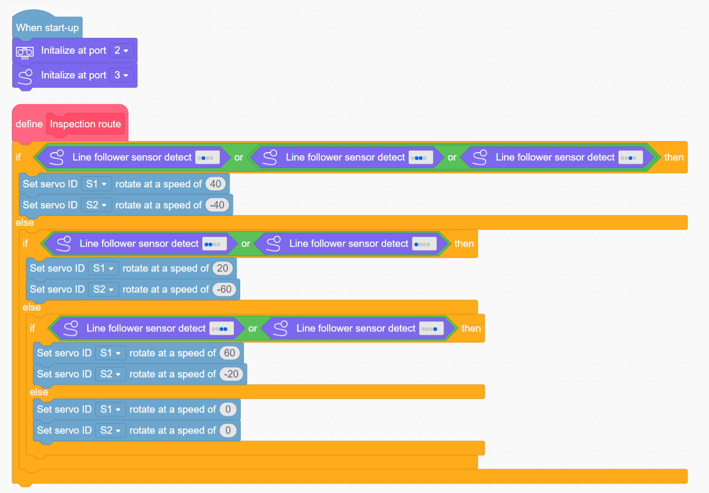

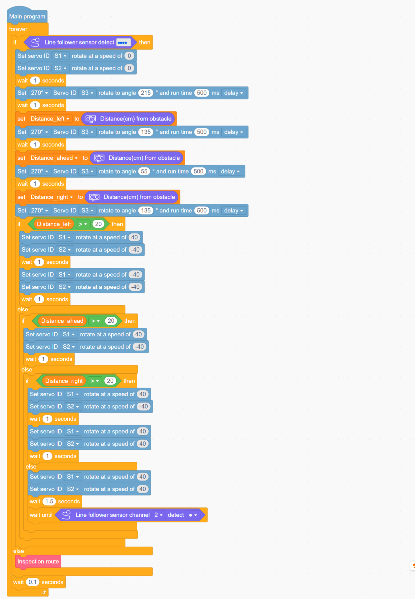

The source files are available for download as a zip archive under [1. Source Code / 02 Program Files for Builds](https://drive.google.com/drive/folders/1guTJsuFCa0f3ZVMcZNNWJ6NruvY7gsUd?usp=sharing).

#### 3. Mode 3 Voice Controlled Movement

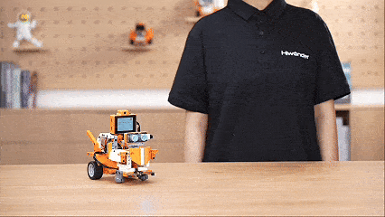

##### (1) Program Concept Diagram

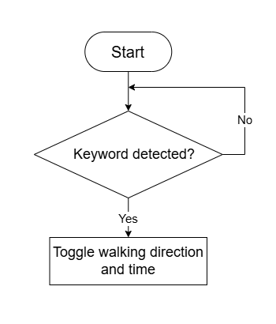

##### (2) Add Extension Libraries

Select **Sensor** in the **Choose an Extension** interface to add **WonderLLM**.

##### (3) Core Blocks Analysis

| Block | Category | Function Description |
| :---: | :---: | :--- |
|  |  | Control the 270° servo of a specified port to rotate smoothly to the target angle within a set duration, with an automatic delay to wait for the servo to complete the action. |
|  |  | Control the 360° servo of a specified port to rotate continuously at a set custom speed. |
|  |  | Send custom text messages to the WonderLLM large model. |
|  |  | Configure mcp tool calling parameters, customize the tool name, description, execution command, and return parameters, and set calling blocking and data return rules. |
|  |  | Turn on or off the mcp switch to control whether WonderLLM enables the custom tool calling capability. |
|  |  | Read the result data returned after the execution of the mcp tool is completed. |
|  |  | Control the conversation message output mode, which can send the action end identifier, and turn on or off the printing output of conversation content. |
|  |  | Perform boolean logical judgments, evaluating input conditions for true/false states or applying negation operations. |
|  |  | Customize the entry or invocation of text content to generate string data for concatenation, judgment, and display. |
|  |  | Determine whether a specified element exists in an array, tuple, or dictionary, returning a boolean result. |
|  |  | Extract the corresponding stored value or text content from a dictionary based on a specified key name. |
|  |  | Create a custom function block and set the function name and incoming parameters of number or text type to encapsulate and reuse a segment of program logic. |
|  |  | Provide number or text parameter inputs for the custom function to be called by the program inside the function. |
|  |  | Call the defined custom function block to execute all program code encapsulated inside that function. |

##### (4) MCP Parameter Configuration

​	**Tool Name: `self.robot.setMove`**

​		1. Tool Description: You are a moving vehicle that can move forward, backward, turn left and turn right. Parameter description: 1. Movement mode: forward is 1, backward is 2, left turn is 3, right turn is 4; 2. Movement time: in milliseconds, the default value is 2 seconds.

​		2. Command Name: `setMove`

​		3. **Return Parameters:** `[["move","string"],["time","int","2000","0","10000"],["direction","int","0","0","4"]]` **Note that the field name move is a string type. The field name time is an integer type, with a default value of 2000, a minimum value of 0, and a maximum value of 10000. The field name direction is an integer type, where the first 0 is the default value, the second 0 is the minimum value, and 4 is the maximum value.**

​		4. Block until completion: Yes

​		5. Return data: No

​		6. Function: This MCP configuration defines a vehicle movement control tool for the WonderLLM module. It allows WonderLLM to issue 0 to 4 direction level commands and 0 to 10000 millisecond duration commands to control the vehicle to move forward, backward, turn left, and turn right. The program blocks during the call to wait for the complete movement action to finish, and no operational data needs to be returned to WonderLLM.

##### (5) Complete Program

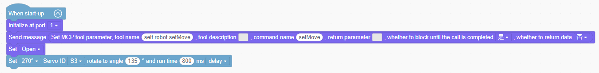

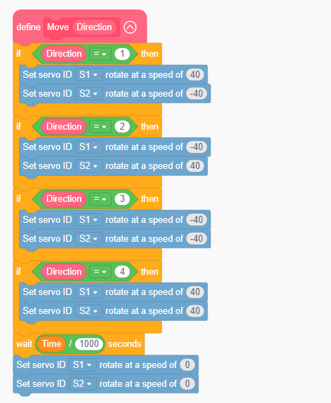

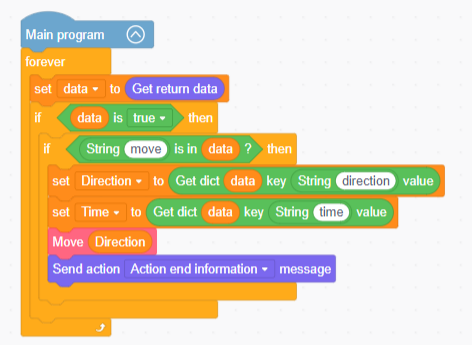

The source files are available for download as a zip archive under [1. Source Code / 02 Program Files for Builds](https://drive.google.com/drive/folders/1guTJsuFCa0f3ZVMcZNNWJ6NruvY7gsUd?usp=sharing).

### 3.26.7 Downloading Programs

### 3.26.8 Project Extensions

Upon receiving the voice command "Line following mode," the car tracks the black line. When switched to "Obstacle avoidance mode," it navigates freely without a path while the 270° servo continuously sweeps the ultrasonic sensor to scan for obstacles. In "Voice control mode," the car responds to directional steering commands, allowing switching between all three modes entirely via voice.

### 3.26.9 Technical Support and Discussion

Join the forum for sharing questions, ideas, or suggestions, and answers will be provided promptly. Click the hyperlink [Hiwonder Forum](http://forum.hiwonder.com) or enter the URL in a browser: http://forum.hiwonder.com

## 3.27 Iron Clawbot

### 3.27.1 Introduction

This dual-mode robotic vehicle features voice-controlled mobility and smart obstacle avoidance. It supports spoken commands for forward, backward, and steering movements, and utilizes an ultrasonic sensor for navigation. The sensor's LEDs shine green when the path is clear, and switch to a red warning flash as the vehicle maneuvers around detected obstacles.

### 3.27.2 Learning Objectives

1. Understand the 4-channel line follower sensor, ultrasonic sensor, 360° block motor, 270° block servo, and WonderLLM module, mastering the integration of multiple sensors and actuators.
2. Comprehend the operational logic of line tracking and automated obstacle-avoidance grabbing, learning to control the robot car through different programming methods.

### 3.27.3 Assembly Guide

### 3.27.4 Mode Switching

This model requires the **online large model**. If the online large model mode has already been entered, this step can be skipped to proceed directly to the wiring guide. Otherwise, refer to [4.4.10 Firmware Update]() to re-flash the corresponding firmware.

### 3.27.5 Wiring Guide

Connect the dot matrix module cable to port 5 of the ESP32 controller.

Connect the 4-channel line follower sensor cable to port 2 of the ESP32 controller.

Connect the glow ultrasonic sensor cable to port 3 of the ESP32 controller.

Connect the WonderLLM module cable to port 1 of the ESP32 controller.

Connect the left 360° block servo cable to port S1 of the controller, and insert the orange servo wire into the white pin of S1.

Connect the right 360° block servo cable to port S2 of the controller, and insert the orange servo wire into the white pin of S2.

Connect the 270° block servo cable to port S3 of the ESP32 controller, and insert the orange servo wire into the white pin of S3.

As shown in the diagram:

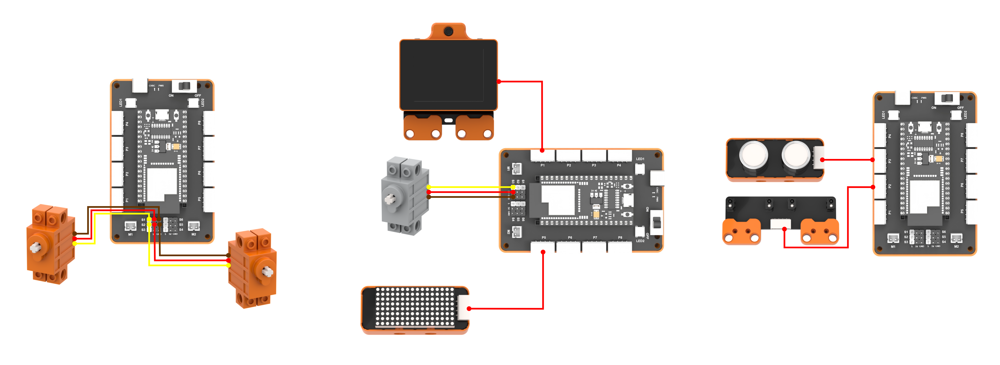

> [!NOTE]
>
> **When conducting a lesson related to the 270° block servo for the first time, remove the gear and its attached building blocks from the 270° servo first, and then upload the following 270° servo reset program to the ESP32 controller. Next, remount the building blocks that were removed, upload the program for this lesson to the ESP32, and wait for the 270° block servo to rotate to its initial position at 135°, making the mechanical claw open. This step can be skipped if the servo reset program has been executed previously.**

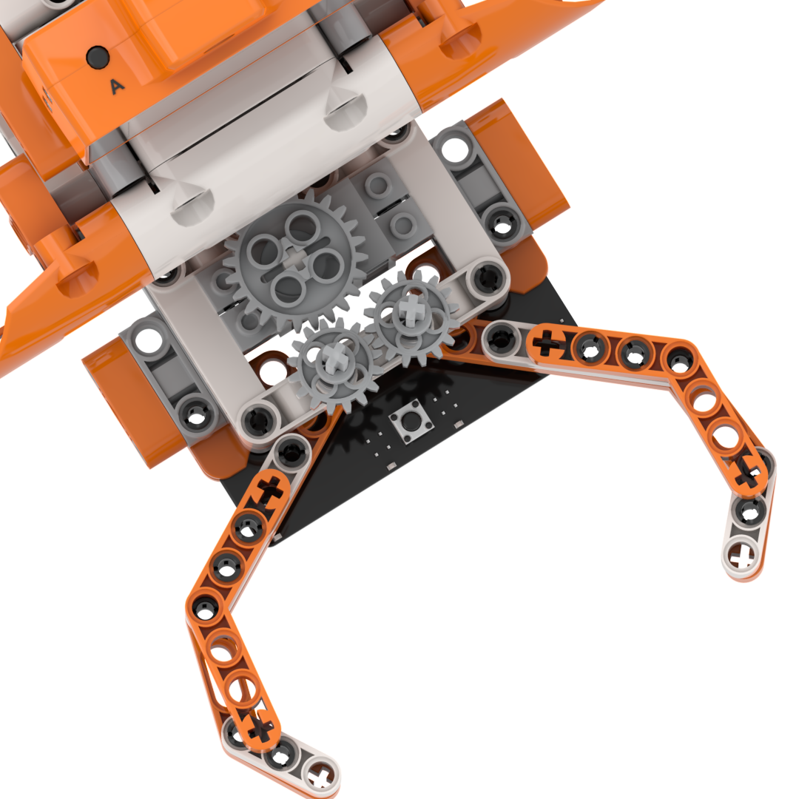

### 3.27.6 Programming

#### 1. Mode 1 Voice Controlled Movement

##### (1) Program Concept Diagram

##### (2) Add Extension Libraries

- Select **Sensor** in the **Choose an Extension** interface to add **WonderLLM**.

- Select **Output module** in the **Choose an Extension** interface to add **Dot matrix module**.

##### (3) Core Blocks Analysis

| Block | Category | Function Description |
| :---: | :---: | :--- |
|  |  | Send custom text messages to the WonderLLM large model. |
|  |  | Configure mcp tool calling parameters, customize the tool name, description, execution command, and return parameters, and set calling blocking and data return rules. |
|  |  | Turn on or off the mcp switch to control whether WonderLLM enables the custom tool calling capability. |
|  |  | Read the result data returned after the execution of the mcp tool is completed. |
|  |  | Control the conversation message output mode, which can send the action end identifier, and turn on or off the printing output of conversation content. |
|  |  | Control the dot matrix screen to load and display preset patterns, allowing custom switching of various graphics and symbol screens. |
|  |  | Control the 270° servo of a specified port to rotate smoothly to the target angle within a set duration, with an automatic delay to wait for the servo to complete the action. |
|  |  | Control the 360° servo of a specified port to rotate continuously at a set custom speed. |
|  |  | Perform boolean logical judgments, evaluating input conditions for true/false states or applying negation operations. |
|  |  | Customize the entry or invocation of text content to generate string data for concatenation, judgment, and display. |
|  |  | Determine whether a specified element exists in an array, tuple, or dictionary, returning a boolean result. |
|  |  | Extract the corresponding stored value or text content from a dictionary based on a specified key name. |

##### (4) MCP Parameter Configuration

​	**Tool Name: `self.robot.setMove`**

​		1. Tool Description: You are a moving vehicle that can move forward, backward, turn left and turn right. Parameter description: 1. Movement mode: forward is 1, backward is 2, left turn is 3, right turn is 4; 2. Movement time: in milliseconds, the default value is 2 seconds.

​		2. Command Name: `setMove`

​		3. **Return Parameters:** `[["move","string"],["time","int","2000","0","10000"],["direction","int","0","0","4"]]` **Note that the field name move is a string type. The field name time is an integer type, with a default value of 2000, a minimum value of 0, and a maximum value of 10000. The field name direction is an integer type, where the first 0 is the default value, the second 0 is the minimum value, and 4 is the maximum value.**

​		4. Block until completion: Yes

​		5. Return data: No

​		6. Function: This MCP configuration defines a vehicle movement control tool for the WonderLLM module. It allows WonderLLM to issue 0 to 4 direction level commands and 0 to 10000 millisecond duration commands to control the vehicle to move forward, backward, turn left, and turn right. The program blocks during the call to wait for the complete movement action to finish, and no operational data needs to be returned to WonderLLM.

##### (5) Complete Program

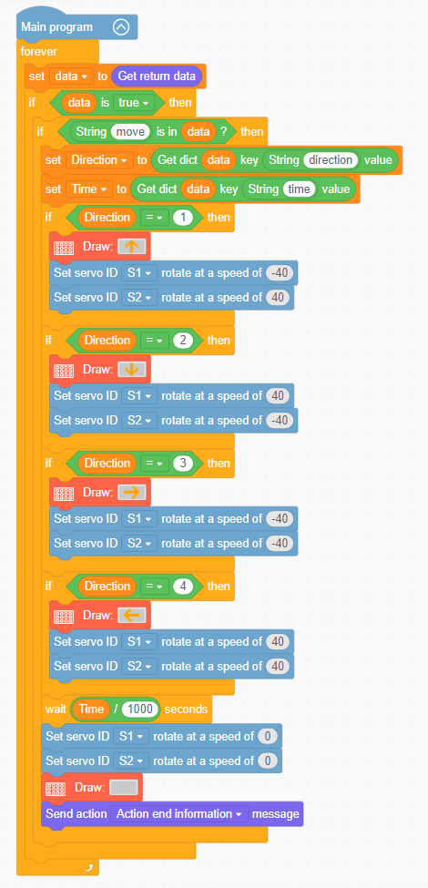

The source files are available for download as a zip archive under [1. Source Code / 02 Program Files for Builds](https://drive.google.com/drive/folders/1guTJsuFCa0f3ZVMcZNNWJ6NruvY7gsUd?usp=sharing).

#### 2. Mode 2 Line Following and Object Grabbing

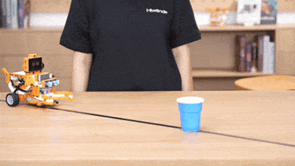

##### (1) Program Concept Diagram

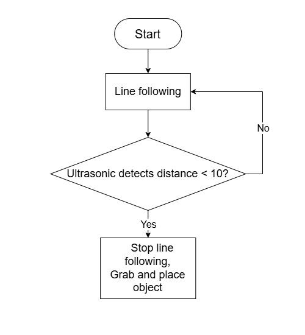

##### (2) Add Extension Libraries

Select **Sensor** in the **Choose an Extension** interface to add **Glowy ultrasonic sensor** and **4-channel line follower sensor**.

##### (3) Core Blocks Analysis

| Block | Category | Function Description |
| :---: | :---: | :--- |
|  |  | Control the 360° servo of a specified port to rotate continuously at a set custom speed. |
|  |  | Control the 270° servo of a specified port to rotate smoothly to the target angle within a set duration, with an automatic delay to wait for the servo to complete the action. |
|  |  | Read the black and white ground detection status of the corresponding channel of the 4-channel line follower sensor, returning a boolean value to judge whether the current channel has detected the black line. |
|  |  | Get the obstacle distance data measured by the ultrasonic sensor in centimeters. |
|  |  | Create a custom function block to encapsulate a segment of reusable program logic. |
|  |  | Call the defined custom function to execute all program logic encapsulated inside it. |

##### (4) Complete Program

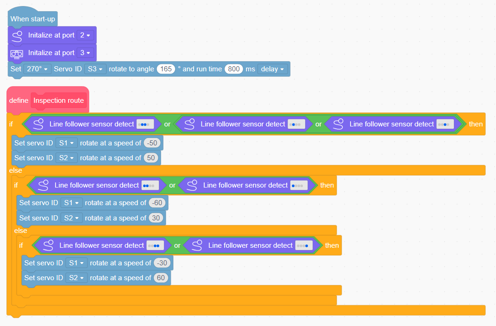

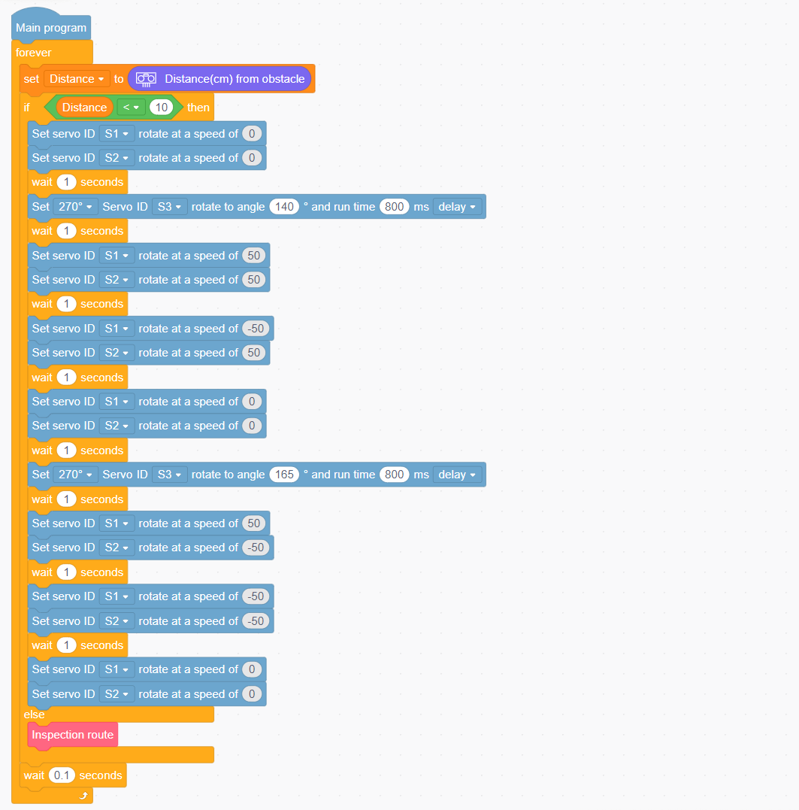

The source files are available for download as a zip archive under [1. Source Code / 02 Program Files for Builds](https://drive.google.com/drive/folders/1guTJsuFCa0f3ZVMcZNNWJ6NruvY7gsUd?usp=sharing).

### 3.27.7 Downloading Programs

### 3.27.8 Project Extensions

During line following, the ultrasonic sensor automatically triggers the claw's grabbing sequence. The dot matrix display increments its count by 1 after each successful pickup and placement, showing **GOOD** once the target count of 5 is achieved.

### 3.27.9 Technical Support and Discussion

Join the forum for sharing questions, ideas, or suggestions, and answers will be provided promptly. Click the hyperlink [Hiwonder Forum](http://forum.hiwonder.com) or enter the URL in a browser: http://forum.hiwonder.com

## 3.28 Tumble Dumper

### 3.28.1 Introduction

This dual-mode dumper vehicle features smart obstacle detection and voice-assisted transport. The vehicle halts automatically when the ultrasonic sensor detects an obstacle, allowing voice commands to steer the chassis. Once the path is clear, it automatically resumes line-tracking cruise along the black line.

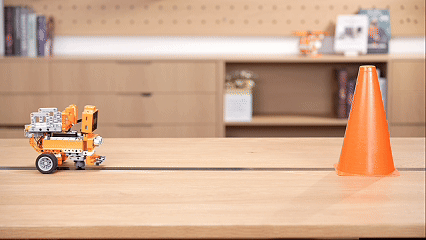

### 3.28.2 Learning Objectives

1. Understand the 4-channel line follower sensor, glowy ultrasonic sensor, 360° block motor, 270° block servo, and WonderLLM module, mastering coordinated control of multiple sensors and actuators.
2. Comprehend the control principles behind ultrasonic obstacle avoidance alerts and voice-command transport, programming conditional statements to switch between different operational modes.

### 3.28.3 Assembly Guide

### 3.28.4 Mode Switching

This model requires the **online large model**. If the online large model mode has already been entered, this step can be skipped to proceed directly to the wiring guide. Otherwise, refer to [4.4.10 Firmware Update]() to re-flash the corresponding firmware.

### 3.28.5 Wiring Guide

Connect the glow ultrasonic sensor cable to port 3 of the ESP32 controller.

Connect the 4-channel line follower sensor cable to port 4 of the ESP32 controller.

Connect the WonderLLM module cable to port 2 of the ESP32 controller.

Connect the 270° block servo cable to port S1 of the ESP32 controller, and insert the orange servo wire into the white pin of S1.

Connect the left 360° block servo cable to port S2 of the controller, and insert the orange servo wire into the white pin of S2.

Connect the right 360° block servo cable to port S3 of the controller, and insert the orange servo wire into the white pin of S3.

As shown in the diagram:

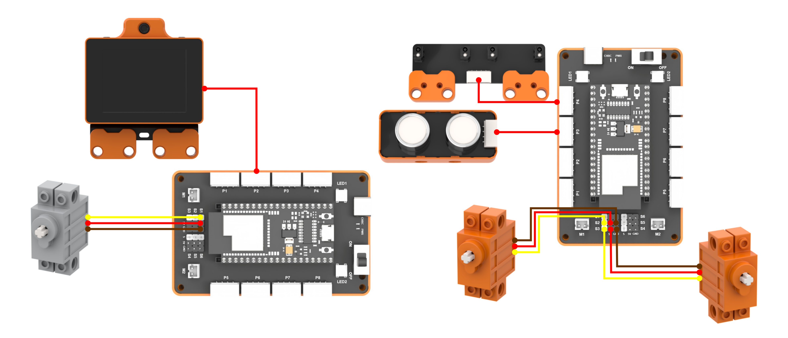

> [!NOTE]
>
> **When conducting a lesson related to the 270° block servo for the first time, remove the gear and its attached building blocks from the 270° servo first, and then upload the following 270° servo reset program to the ESP32 controller. Next, remount the building blocks that were removed, upload the program for this lesson to the ESP32, and wait for the 270° block servo to rotate to its initial position at 135°, leaving the dumper device horizontal and not tilted. This step can be skipped if the servo reset program has been executed previously.**

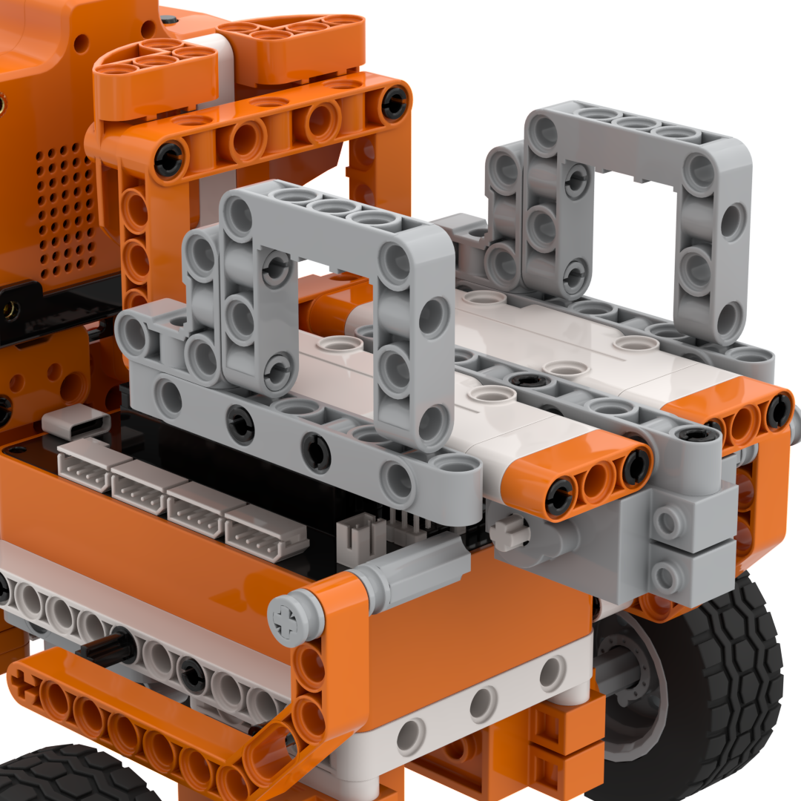

### 3.28.6 Programming

#### 1. Mode 1 Line Following Obstacle Avoidance Alert

##### (1) Program Concept Diagram

##### (2) Add Extension Libraries

Select **Sensor** in the **Choose an Extension** interface to add **Glowy ultrasonic sensor** and **4-channel line follower sensor**.

##### (3) Core Blocks Analysis

| Block | Category | Function Description |
| :---: | :---: | :--- |
|  |  | Control the 360° servo of a specified port to rotate continuously at a set custom speed. |
|  |  | Immediately terminate the rotation of the 360° servo at the specified port, bringing the servo to a stop. |
|  |  | Drive the buzzer to play music of the specified pitch and beat, without blocking subsequent program execution when running in background mode. |
|  |  | Get the obstacle distance data measured by the ultrasonic sensor in centimeters. |
| 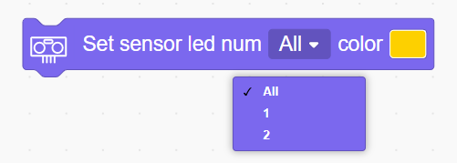 |  | Control the RGB lights on the glow ultrasonic module of a specified number, such as 1, 2, or all, to light up in the selected color. |
|  |  | Create a custom function block to encapsulate a segment of reusable program logic. |
|  |  | Call the defined custom function to execute all program logic encapsulated inside it. |

##### (4) Complete Program

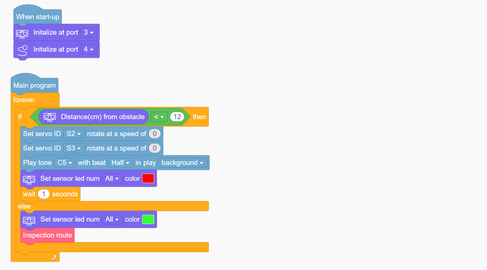

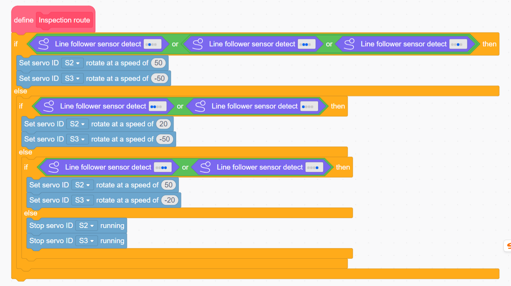

The source files are available for download as a zip archive under [1. Source Code / 02 Program Files for Builds](https://drive.google.com/drive/folders/1guTJsuFCa0f3ZVMcZNNWJ6NruvY7gsUd?usp=sharing).

#### 2. Mode 2 Voice Controlled Transport

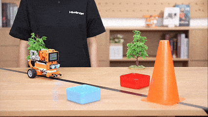

##### (1) Program Concept Diagram

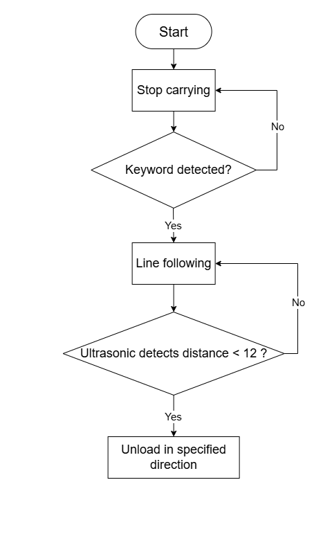

##### (2) Add Extension Libraries

Select **Sensor** in the **Choose an Extension** interface to add **Glowy ultrasonic sensor**, **4-channel line follower sensor**, and **WonderLLM**.

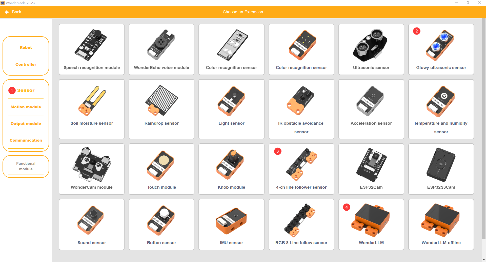

##### (3) Core Blocks Analysis

| Block | Category | Function Description |
| :---: | :---: | :--- |
|  |  | Control the 270° servo of a specified port to rotate smoothly to the target angle within a set duration, with an automatic delay to wait for the servo to complete the action. |
|  |  | Control the 360° servo of a specified port to rotate continuously at a set custom speed. |
|  |  | Immediately terminate the rotation of the 360° servo at the specified port, bringing the servo to a stop. |
|  |  | Send custom text messages to the WonderLLM large model. |
|  |  | Configure mcp tool calling parameters, customize the tool name, description, execution command, and return parameters, and set calling blocking and data return rules. |
|  |  | Turn on or off the mcp switch to control whether WonderLLM enables the custom tool calling capability. |
|  |  | Read the result data returned after the execution of the mcp tool is completed. |
|  |  | Control the conversation message output mode, which can send the action end identifier, and turn on or off the printing output of conversation content. |
|  |  | Read the black and white ground detection status of the corresponding channel of the 4-channel line follower sensor, returning a boolean value to judge whether the current channel has detected the black line. |
|  |  | Get the obstacle distance data measured by the ultrasonic sensor in centimeters. |
|  |  | Perform boolean logical judgments, evaluating input conditions for true/false states or applying negation operations. |
|  |  | Customize the entry or invocation of text content to generate string data for concatenation, judgment, and display. |
|  |  | Determine whether a specified element exists in an array, tuple, or dictionary, returning a boolean result. |
|  |  | Extract the corresponding stored value or text content from a dictionary based on a specified key name. |
|  |  | Create a custom function block and set the function name and incoming parameters of number or text type to encapsulate and reuse a segment of program logic. |
|  |  | Provide number or text parameter inputs for the custom function to be called by the program inside the function. |
|  |  | Call the defined custom function block to execute all program code encapsulated inside that function. |
|  |  | Create a custom function block to encapsulate a segment of reusable program logic. |
|  |  | Call the defined custom function to execute all program logic encapsulated inside it. |

##### (4) MCP Parameter Configuration

​	**Tool Name: `self.robot.setRobot`**

​		1. Tool Description: You are a tricycle capable of transporting items. Parameter description: 1. Direction: return 1 if transporting to the left; return 2 if transporting to the right.

​		2. Command Name: `setRobot`

​		3. **Return Parameters:** `[["direction","int","0","0","2"]]` **Note that the field name direction is an integer type, where the first 0 is the default value, the second 0 is the minimum value, and 2 is the maximum value.**

​		4. Block until completion: Yes

​		5. Return data: No

​		6. Function: This MCP configuration defines a dump truck transport control tool for the WonderLLM module. It allows WonderLLM to issue 0 to 2 direction level commands to control the dump truck to transport items to the left or right. The program blocks during the call to wait for the transportation action to finish, and no operational data needs to be returned to WonderLLM.

##### (5) Complete Program

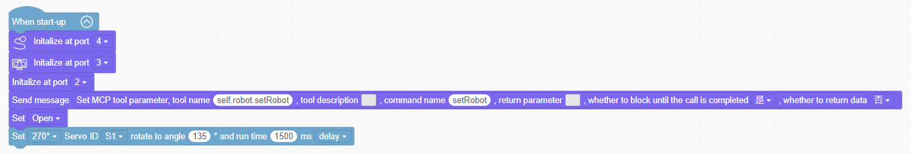

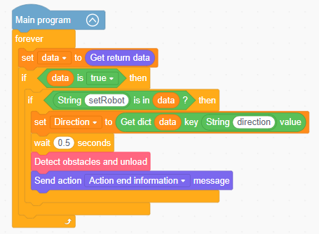

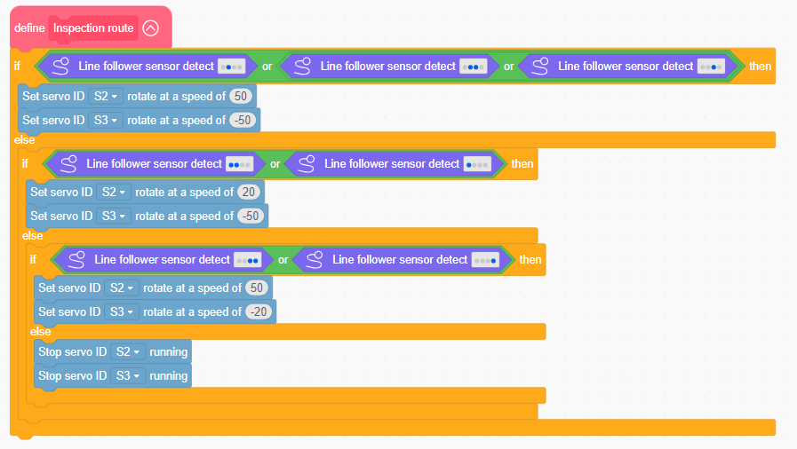

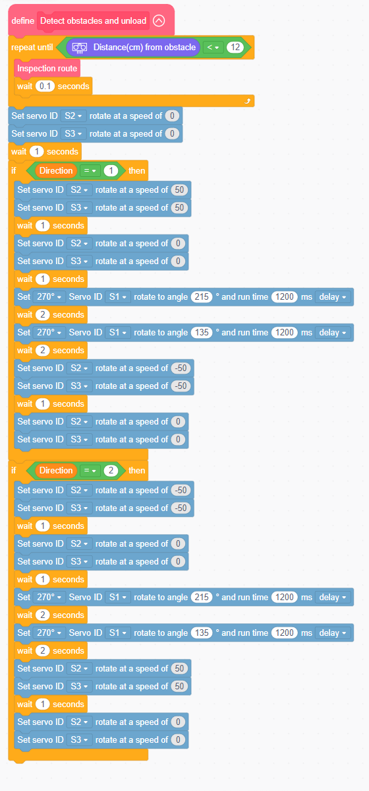

The source files are available for download as a zip archive under [1. Source Code / 02 Program Files for Builds](https://drive.google.com/drive/folders/1guTJsuFCa0f3ZVMcZNNWJ6NruvY7gsUd?usp=sharing).

### 3.28.7 Downloading Programs

### 3.28.8 Project Extensions

Spoken commands select left or right unloading modes as the vehicle travels along the line. Upon detecting a terminal obstacle, it halts and tilts the dumper bed to unload, resetting the bed automatically before continuing. Issuing the voice command "Circular Transport" enables continuous reciprocating transport and unloading, while the glowy ultrasonic sensor's LEDs shine solid green when clear and flash red to alert when blocked.

### 3.28.9 Technical Support and Discussion

Join the forum for sharing questions, ideas, or suggestions, and answers will be provided promptly. Click the hyperlink [Hiwonder Forum](http://forum.hiwonder.com) or enter the URL in a browser: http://forum.hiwonder.com

## 3.29 Biped Bot

### 3.29.1 Introduction

This walking biped robot features environment-sensing capabilities. It supports voice commands for forward and backward movement with customizable durations, while the dot matrix display dynamically shows real-time temperature and humidity, combining walking mobility with environmental monitoring.

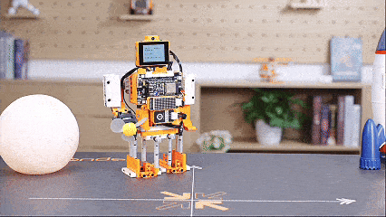

### 3.29.2 Learning Objectives

1. Understand the 360° block motor, 270° block servo, fan module, temperature/humidity sensor, dot matrix display, and WonderLLM module, mastering coordinated control of multiple components.
2. Comprehend the implementation logic of voice-controlled walking, fan activation, and data display switching, learning to coordinate multiple devices through large AI model instructions.

### 3.29.3 Assembly Guide

### 3.29.4 Mode Switching

This model requires the **online large model**. If the online large model mode has already been entered, this step can be skipped to proceed directly to the wiring guide. Otherwise, refer to [4.4.10 Firmware Update]() to re-flash the corresponding firmware.

### 3.29.5 Wiring Guide

Connect the dot matrix module cable to port 5 of the ESP32 controller.

Connect the fan module cable to port 8 of the ESP32 controller.

Connect the temperature and humidity sensor cable to port 3 of the ESP32 controller.

Connect the WonderLLM module cable to port 2 of the ESP32 controller.

Connect the 360° block servo cable to port S1 of the ESP32 controller, and insert the orange servo wire into the white pin of S1.

Connect the 270° block servo cable to port S2 of the ESP32 controller, and insert the orange servo wire into the white pin of S2.

As shown in the diagram:

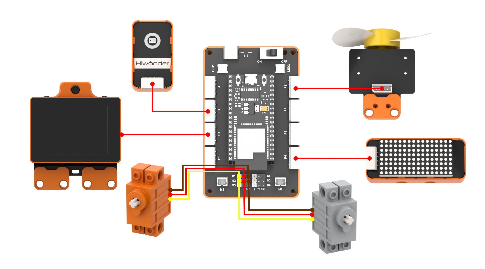

> [!NOTE]
>
> **When conducting a lesson related to the 270° block servo for the first time, remove the gear and its attached building blocks from the 270° servo first, and then upload the following 270° servo reset program to the ESP32 controller. Next, remount the building blocks that were removed, upload the program for this lesson to the ESP32, and wait for the 270° block servo to rotate to its initial position at 135°, leaving the arm in a lowered state. This step can be skipped if the servo reset program has been executed previously.**

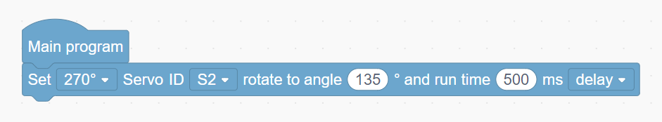

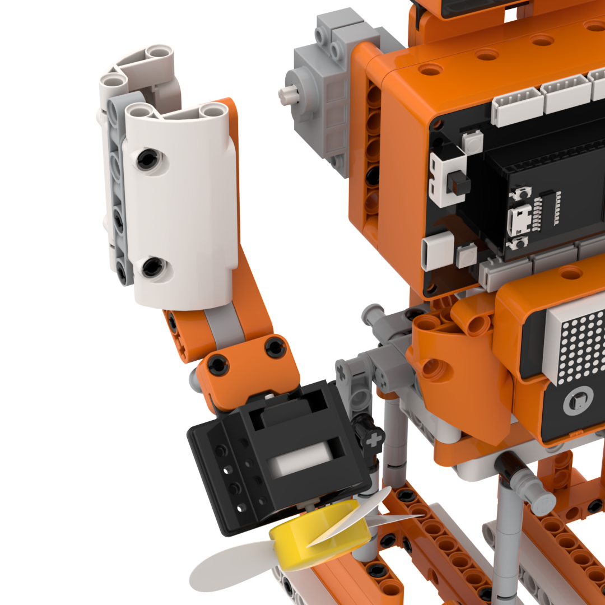

### 3.29.6 Programming

#### (1) Program Concept Diagram

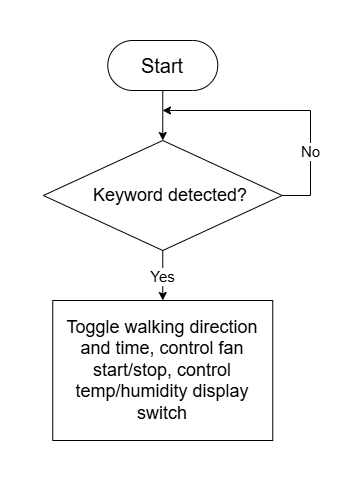

#### (2) Add Extension Libraries

- Select **Sensor** in the **Choose an Extension** interface to add **Temperature and humidity sensor** and **WonderLLM**.

- Select **Output module** in the **Choose an Extension** interface to add **Fan module (Black)** and **Dot matrix module**.

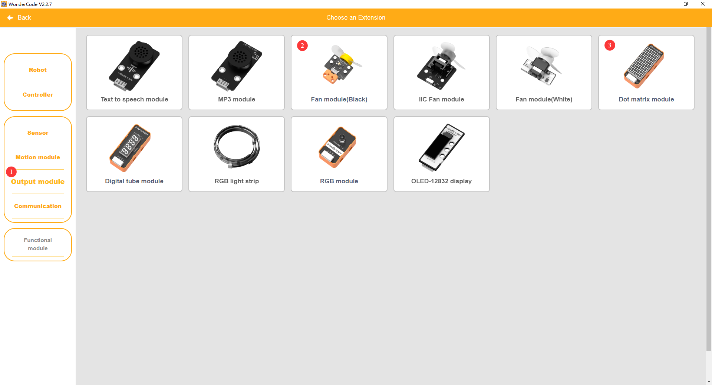

#### (3) Core Blocks Analysis

| Block | Category | Function Description |
| :---: | :---: | :--- |
|  |  | Send custom text messages to the WonderLLM large model. |
|  |  | Configure mcp tool calling parameters, customize the tool name, description, execution command, and return parameters, and set calling blocking and data return rules. |
|  |  | Turn on or off the mcp switch to control whether WonderLLM enables the custom tool calling capability. |
|  |  | Read the result data returned after the execution of the mcp tool is completed. |
|  |  | Control the conversation message output mode, which can send the action end identifier, and turn on or off the printing output of conversation content. |
|  |  | Read the ambient temperature or humidity value collected by the temperature and humidity sensor at the corresponding port. |
|  |  | Control the dot matrix screen to output and display a specified number, with real-time screen value refreshing. |
|  |  | Control the dot matrix screen to load and display preset patterns, allowing custom switching of various graphics and symbol screens. |
|  |  | Control the specified fan interface, setting a speed value within the range of 0 to 100 to adjust the fan power. |
|  |  | Control the 270° servo of a specified port to rotate smoothly to the target angle within a set duration, with an automatic delay to wait for the servo to complete the action. |
|  |  | Control the 360° servo of a specified port to rotate continuously at a set custom speed. |
|  |  | Perform boolean logical judgments, evaluating input conditions for true/false states or applying negation operations. |
|  |  | Customize the entry or invocation of text content to generate string data for concatenation, judgment, and display. |
|  |  | Determine whether a specified element exists in an array, tuple, or dictionary, returning a boolean result. |
|  |  | Extract the corresponding stored value or text content from a dictionary based on a specified key name. |

#### (4) MCP Parameter Configuration

​	**Tool Name: `self.robot.controlMove`**

​		1. Tool Description: You are a Biped Bot that can move forward and backward. Parameters: 1. Movement direction: forward is 1, backward is 2; 2. Duration: measured in milliseconds, with the default duration being 5 seconds.

​		2. Command Name: `controlMove`

​		3. **Return Parameters:** `[["move","int","0","0","4"],["time","int","5000","0","10000"]]` **Note that the field name move is an integer type, where the first 0 is the default value, the second 0 is the minimum value, and 4 is the maximum value. The field name time is an integer type, with a default value of 5000, a minimum value of 0, and a maximum value of 10000.**

​		4. Block until completion: Yes

​		5. Return data: No

​		6. Function: This MCP configuration defines a Biped Bot movement control tool for the WonderLLM module. It allows WonderLLM to issue 0 to 4 movement level commands and 0 to 10000 millisecond duration commands to control the robot to move forward and backward. The program blocks during the call to wait for the complete movement action to finish, and no operational data needs to be returned to WonderLLM.

​	**Tool Name: `self.robot.controlFan`**

​		1. Tool Description: You can control the start and stop of the fan. Parameters: 1. Status: Turning on the fan is 1, and turning off the fan is 0.

​		2. Command Name: `controlFan`

​		3. **Return Parameters:** `[["fan","int","0","0","1"]]` **Note that the field name fan is an integer type, where the first 0 is the default value, the second 0 is the minimum value, and 1 is the maximum value.**

​		4. Block until completion: Yes

​		5. Return data: No

​		6. Function: This MCP configuration defines a fan control tool for the WonderLLM module. It allows WonderLLM to issue 0 to 1 switch commands to control the fan start and stop. The program blocks during the call to wait for the fan state switch to finish, and no operational data needs to be returned to WonderLLM.

​	**Tool Name: `self.robot.controlDisplay`**

​		1. Tool Description: You can control the display of temperature and humidity. Parameters: 1. Status: Use 1 to display temperature, use 2 to display humidity, use 0 to turn off the display.

​		2. Command Name: `setRobot`

​		3. **Return Parameters:** `[["display","int","0","0","2"]]` **Note that the field name display is an integer type, where the first 0 is the default value, the second 0 is the minimum value, and 2 is the maximum value.**

​		4. Block until completion: Yes

​		5. Return data: No

​		6. Function: This MCP configuration defines a temperature and humidity screen control tool for the WonderLLM module. It allows WonderLLM to issue 0 to 2 level commands to switch the display screen to show temperature, humidity, or turn off the screen. The program blocks during the call to wait for the display switch to finish, and no operational data needs to be returned to WonderLLM.

#### (5) Complete Program

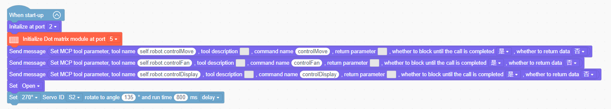

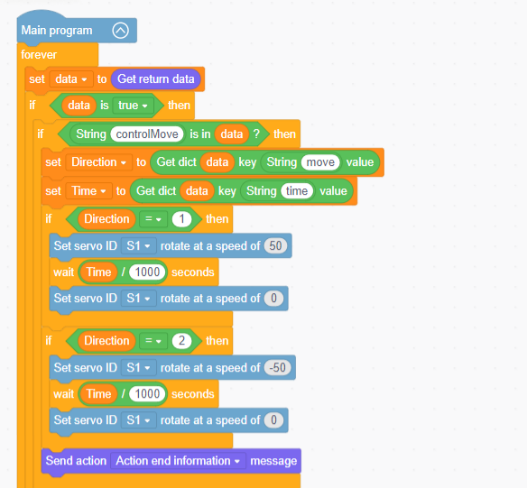

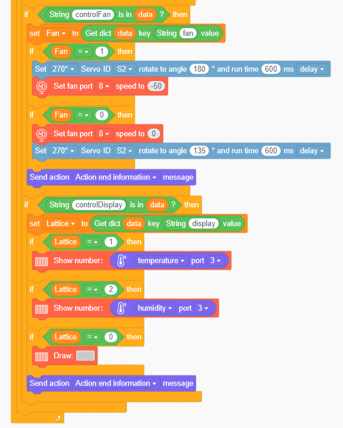

The source files are available for download as a zip archive under [1. Source Code / 02 Program Files for Builds](https://drive.google.com/drive/folders/1guTJsuFCa0f3ZVMcZNNWJ6NruvY7gsUd?usp=sharing).

### 3.29.7 Downloading Programs

### 3.29.8 Project Extensions

After voice-retrieving the temperature and humidity data, the dot matrix display switches expressions and adjusts walking speed based on the environmental values. It shows a smiley face and walking quickly in comfortable conditions, and displays a sad face and walking slowly if the temperature or humidity is too high.

### 3.29.9 Technical Support and Discussion

Join the forum for sharing questions, ideas, or suggestions, and answers will be provided promptly. Click the hyperlink [Hiwonder Forum](http://forum.hiwonder.com) or enter the URL in a browser: http://forum.hiwonder.com

## 3.30 Charging Knight

### 3.30.1 Introduction

This charging knight robot car features voice-controlled charging sequences. It supports spoken commands for forward and backward movement, while the dot matrix display shows directional indicators and plays a charging animation during forward sprints.

### 3.30.2 Learning Objectives

1. Understand the 360° block motor, 270° block servo, dot matrix display, ultrasonic sensor, and WonderLLM module, mastering voice-controlled coordination of multiple components.
2. Comprehend the control logic of voice-activated forward and backward movement, learning to regulate motor actions by parsing large AI model instructions.

### 3.30.3 Assembly Guide

### 3.30.4 Mode Switching

This model requires the **online large model**. If the online large model mode has already been entered, this step can be skipped to proceed directly to the wiring guide. Otherwise, refer to [4.4.10 Firmware Update]() to re-flash the corresponding firmware.

### 3.30.5 Wiring Guide

Connect the dot matrix module cable to port 7 of the ESP32 controller.

Connect the glow ultrasonic sensor cable to port 3 of the ESP32 controller.

Connect the WonderLLM module cable to port 4 of the ESP32 controller.

Connect the 360° block servo cable to port S1 of the ESP32 controller, and insert the orange servo wire into the white pin of S1.

Connect the 270° block servo cable to port S2 of the ESP32 controller, and insert the orange servo wire into the white pin of S2.

As shown in the diagram:

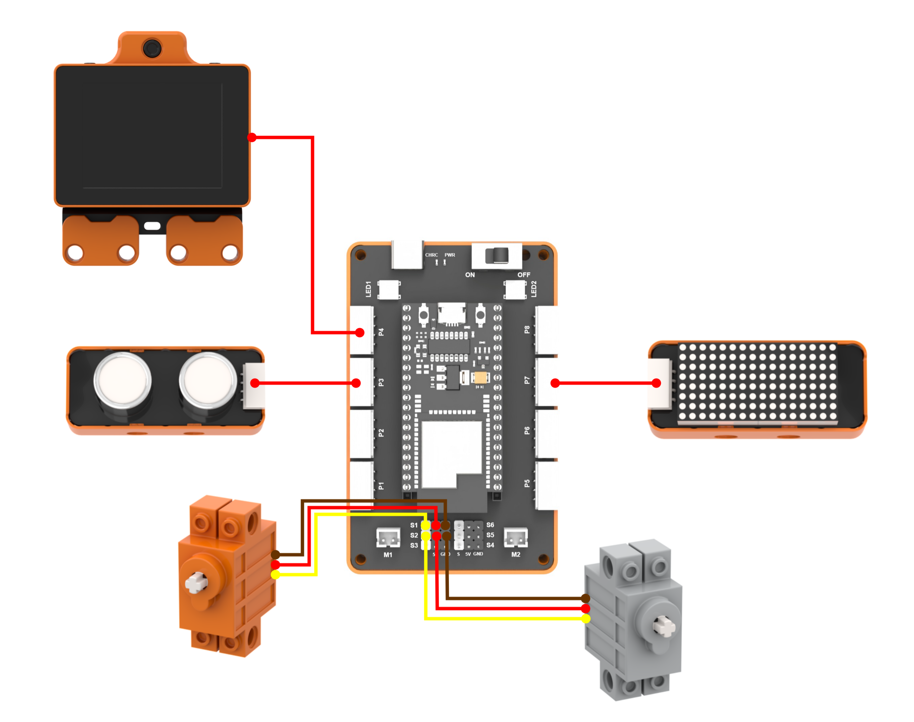

> [!NOTE]
>
> **When conducting a lesson related to the 270° block servo for the first time, remove the gear and its attached building blocks from the 270° servo first, and then upload the following 270° servo reset program to the ESP32 controller. Next, remount the building blocks that were removed, upload the program for this lesson to the ESP32, and wait for the 270° block servo to rotate to its initial position at 135°, leaving the arm in a lowered state. This step can be skipped if the servo reset program has been executed previously.**

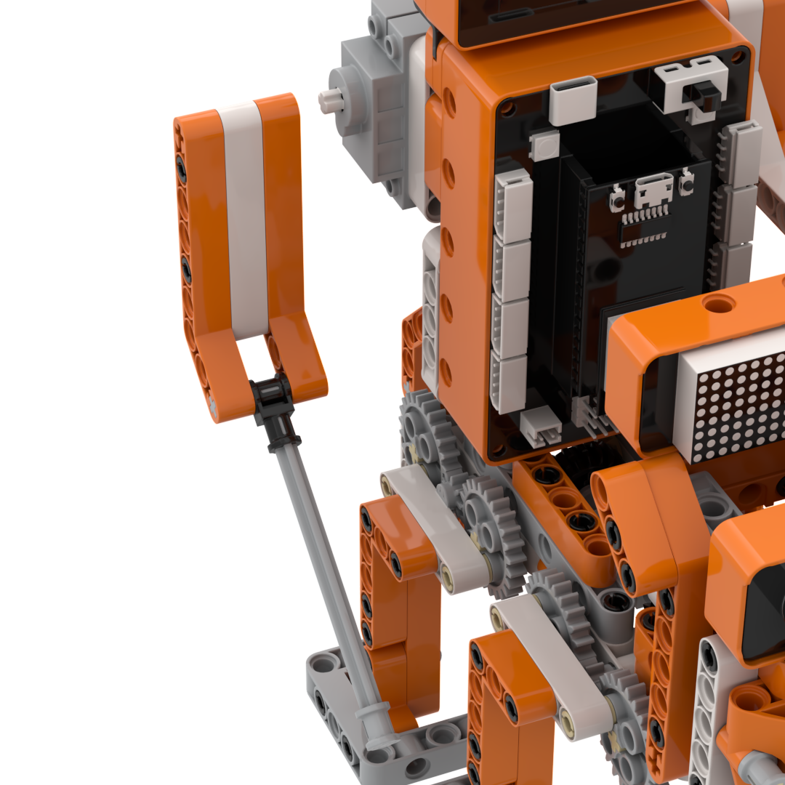

### 3.30.6 Programming

#### 1. Mode 1 Voice Controlled Movement

##### (1) Program Concept Diagram

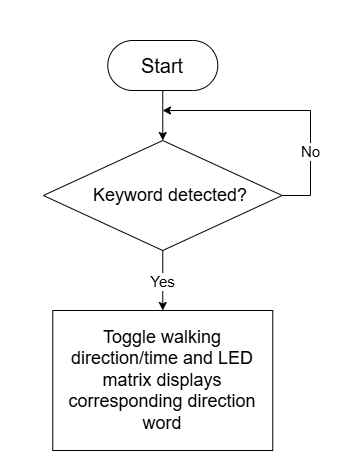

##### (2) Add Extension Libraries

- Select **Sensor** in the **Choose an Extension** interface to add **WonderLLM**.

- Select **Output module** in the **Choose an Extension** interface to add **Dot matrix module**.

##### (3) Core Blocks Analysis

| Block | Category | Function Description |
| :---: | :---: | :--- |
|  |  | Send custom text messages to the WonderLLM large model. |
|  |  | Configure mcp tool calling parameters, customize the tool name, description, execution command, and return parameters, and set calling blocking and data return rules. |
|  |  | Turn on or off the mcp switch to control whether WonderLLM enables the custom tool calling capability. |
|  |  | Read the result data returned after the execution of the mcp tool is completed. |
|  |  | Control the conversation message output mode, which can send the action end identifier, and turn on or off the printing output of conversation content. |
|  |  | Control the dot matrix screen to load and display preset patterns, allowing custom switching of various graphics and symbol screens. |
|  |  | Control the 270° servo of a specified port to rotate smoothly to the target angle within a set duration, with an automatic delay to wait for the servo to complete the action. |
|  |  | Control the 360° servo of a specified port to rotate continuously at a set custom speed. |
|  |  | Perform boolean logical judgments, evaluating input conditions for true/false states or applying negation operations. |
|  |  | Customize the entry or invocation of text content to generate string data for concatenation, judgment, and display. |
|  |  | Determine whether a specified element exists in an array, tuple, or dictionary, returning a boolean result. |
|  |  | Extract the corresponding stored value or text content from a dictionary based on a specified key name. |

##### (4) MCP Parameter Configuration

​	**Tool Name: `self.robot.setMove`**

​		1. Tool Description: You are a knight and can move forward and backward. Main parameters: 1. Movement direction: return 1 for forward, return 2 for backward. 2. Duration: in seconds, if no duration is specified, the default is 2 seconds.

​		2. Command Name: `setMove`

​		3. **Return Parameters:** `[["direction","int","0","0","2"],["time","int","2","0","10"]]` **Note that the field name direction is an integer type, where the first 0 is the default value, the second 0 is the minimum value, and 2 is the maximum value. The field name time is an integer type, with a default value of 2, a minimum value of 0, and a maximum value of 10.**

​		4. Block until completion: Yes

​		5. Return data: No

​		6. Function: This MCP configuration defines a knight robot movement control tool for the WonderLLM module. It allows WonderLLM to issue 0 to 2 direction level commands and 0 to 10 second duration commands to control the robot to move forward and backward. The program blocks during the call to wait for the complete movement action to finish, and no operational data needs to be returned to WonderLLM.

##### (5) Complete Program

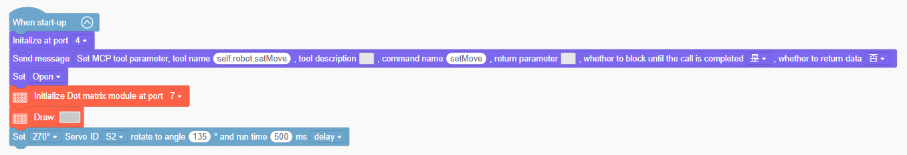

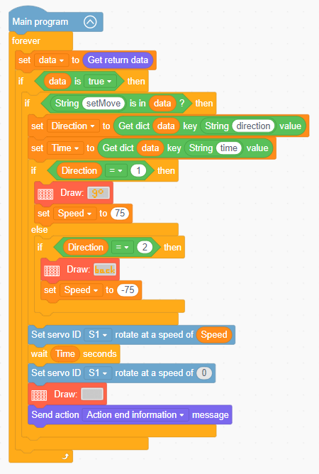

The source files are available for download as a zip archive under [1. Source Code / 02 Program Files for Builds](https://drive.google.com/drive/folders/1guTJsuFCa0f3ZVMcZNNWJ6NruvY7gsUd?usp=sharing).

#### 2. Mode 2 Charging Forward

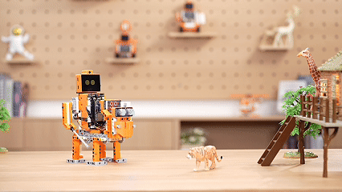

##### (1) Program Concept Diagram

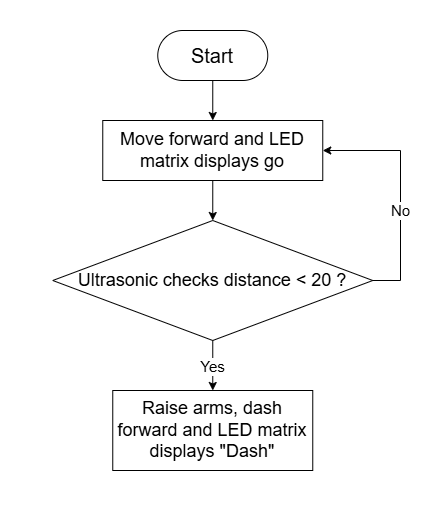

##### (2) Add Extension Libraries

- Select **Sensor** in the **Choose an Extension** interface to add **Glowy ultrasonic sensor**.

- Select **Output module** in the **Choose an Extension** interface to add **Dot matrix module**.

##### (3) Core Blocks Analysis

| Block | Category | Function Description |
| :---: | :---: | :--- |
|  |  | Control the 360° servo of a specified port to rotate continuously at a set custom speed. |
|  |  | Control the 270° servo of a specified port to rotate smoothly to the target angle within a set duration, with an automatic delay to wait for the servo to complete the action. |
|  |  | Get the obstacle distance data measured by the ultrasonic sensor in centimeters. |
|  |  | Control the dot matrix screen to load and display preset patterns, allowing custom switching of various graphics and symbol screens. |

##### (4) Complete Program

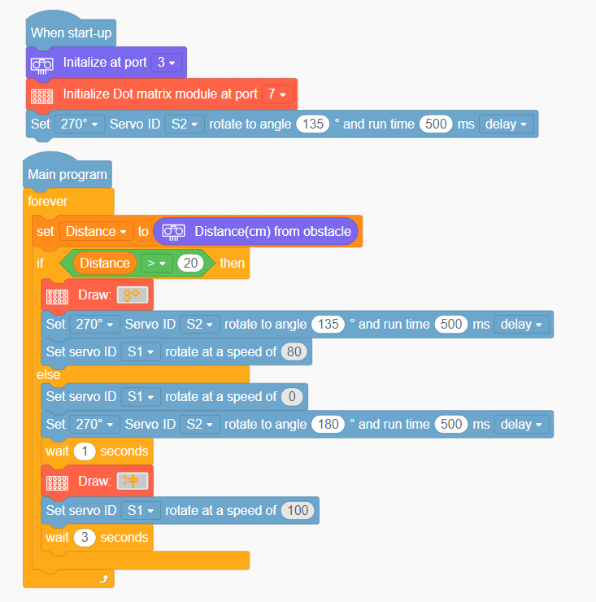

The source files are available for download as a zip archive under [1. Source Code / 02 Program Files for Builds](https://drive.google.com/drive/folders/1guTJsuFCa0f3ZVMcZNNWJ6NruvY7gsUd?usp=sharing).

### 3.30.7 Downloading Programs

### 3.30.8 Project Extensions

For distant obstacles, the car approaches at a low speed while the dot matrix displays **GO.** As an obstacle becomes close, the servo arm lifts rapidly, the car sprints forward as the display shows **SPRINT,** and the buzzer sounds a high-pitched alert. Upon receiving a retreat command, the car reverses and the display switches to **BACK.**

### 3.30.9 Technical Support and Discussion

Join the forum for sharing questions, ideas, or suggestions, and answers will be provided promptly. Click the hyperlink [Hiwonder Forum](http://forum.hiwonder.com) or enter the URL in a browser: http://forum.hiwonder.com

## 3.31 Bionic Spider

### 3.31.1 Introduction

This bionic spider robot features dual-mode walking capabilities. It can track lines and steer automatically along a black path, or receive voice commands to walk left and right with customizable durations.

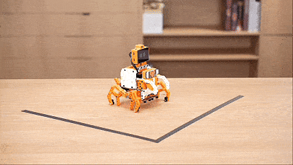

### 3.31.2 Learning Objectives

1. Understand the 360° block motor, 4-channel line follower sensor, dot matrix display, and WonderLLM module, mastering coordinated control of multiple devices.
2. Comprehend the control logic of automated line-tracking steering and voice-controlled walking, learning to program diverse robot behaviors.

### 3.31.3 Assembly Guide

### 3.31.4 Mode Switching

This model requires the **online large model**. If the online large model mode has already been entered, this step can be skipped to proceed directly to the wiring guide. Otherwise, refer to [4.4.10 Firmware Update]() to re-flash the corresponding firmware.

### 3.31.5 Wiring Guide

Connect the dot matrix module cable to port 5 of the ESP32 controller.

Connect the 4-channel line follower sensor cable to port 1 of the ESP32 controller.

Connect the WonderLLM module cable to port 4 of the ESP32 controller.

Connect the left 360° block servo cable to port S1 of the controller, and insert the orange servo wire into the white pin of S1.

Connect the right 360° block servo cable to port S2 of the controller, and insert the orange servo wire into the white pin of S2.

As shown in the diagram:

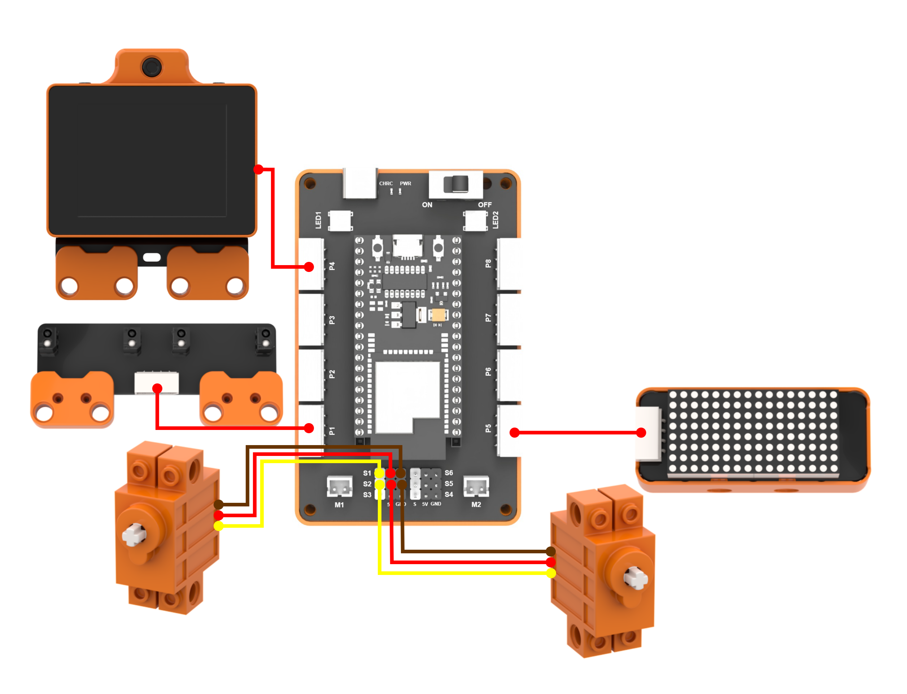

### 3.31.6 Programming

#### 1. Mode 1 Cliff Avoidance

##### (1) Program Concept Diagram

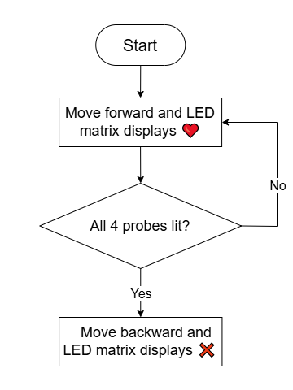

##### (2) Add Extension Libraries

- Select **Sensor** in the **Choose an Extension** interface to add **4-channel line follower sensor**.

- Select **Output module** in the **Choose an Extension** interface to add **Dot matrix module**.

##### (3) Core Blocks Analysis

| Block | Category | Function Description |
| :---: | :---: | :--- |
|  |  | Control the 360° servo of a specified port to rotate continuously at a set custom speed. |
|  |  | Read the black and white ground detection status of the corresponding channel of the 4-channel line follower sensor, returning a boolean value to judge whether the current channel has detected the black line. |
|  |  | Control the dot matrix screen to load and display preset patterns, allowing custom switching of various graphics and symbol screens. |

##### (4) Complete Program

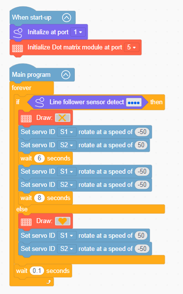

The source files are available for download as a zip archive under [1. Source Code / 02 Program Files for Builds](https://drive.google.com/drive/folders/1guTJsuFCa0f3ZVMcZNNWJ6NruvY7gsUd?usp=sharing).

#### 2. Mode 2 Voice Controlled

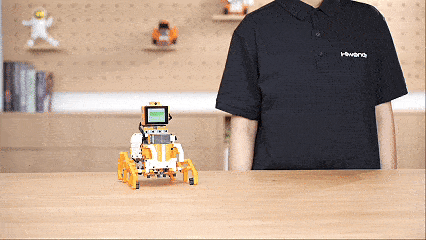

##### (1) Program Concept Diagram

##### (2) Add Extension Libraries

Select **Sensor** in the **Choose an Extension** interface to add **WonderLLM**.

##### (3) Core Blocks Analysis

| Block | Category | Function Description |
| :---: | :---: | :--- |
|  |  | Send custom text messages to the WonderLLM large model. |
|  |  | Configure mcp tool calling parameters, customize the tool name, description, execution command, and return parameters, and set calling blocking and data return rules. |
|  |  | Turn on or off the mcp switch to control whether WonderLLM enables the custom tool calling capability. |
|  |  | Read the result data returned after the execution of the mcp tool is completed. |
|  |  | Control the conversation message output mode, which can send the action end identifier, and turn on or off the printing output of conversation content. |
|  |  | Control the 360° servo of a specified port to rotate continuously at a set custom speed. |
|  |  | Perform boolean logical judgments, evaluating input conditions for true/false states or applying negation operations. |
|  |  | Customize the entry or invocation of text content to generate string data for concatenation, judgment, and display. |
|  |  | Determine whether a specified element exists in an array, tuple, or dictionary, returning a boolean result. |
|  |  | Extract the corresponding stored value or text content from a dictionary based on a specified key name. |

##### (4) MCP Parameter Configuration

​	**Tool Name: `self.robot.setMove`**

​		1. Tool Description: You are a robot that can move forward, backward, turn left, and turn right. Parameter description: 1 Movement direction: return 1 when moving forward, return 2 when moving backward, return 3 when turning left, and return 4 when turning right; 2. Movement time: measured in milliseconds, default value is 2 seconds.

​		2. Command Name: `setMove`

​		3. **Return Parameters:** `[["direction","int","0","0","4"],["time","int","2000","0","10000"]]` **Note that the field name direction is an integer type, where the first 0 is the default value, the second 0 is the minimum value, and 4 is the maximum value. The field name time is an integer type, with a default value of 2000, a minimum value of 0, and a maximum value of 10000.**

​		4. Block until completion: Yes

​		5. Return data: No

​		6. Function: This MCP configuration defines a robot movement control tool for the WonderLLM module. It allows WonderLLM to issue 0 to 4 direction level commands and 0 to 10000 millisecond duration commands to control the robot to move forward, backward, turn left, and turn right. The program blocks during the call to wait for the complete movement action to finish, and no operational data needs to be returned to WonderLLM.

##### (5) Complete Program

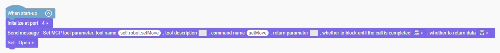

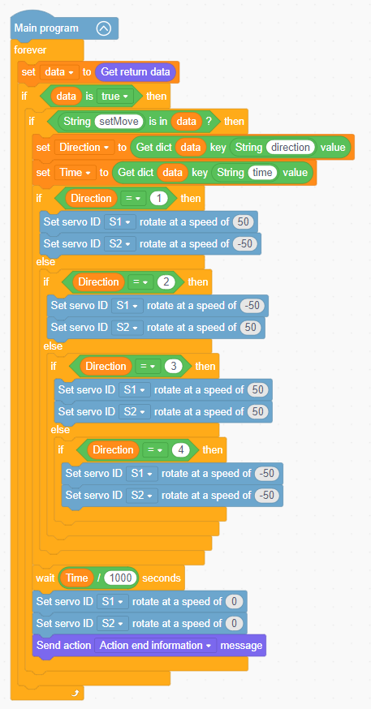

The source files are available for download as a zip archive under [1. Source Code / 02 Program Files for Builds](https://drive.google.com/drive/folders/1guTJsuFCa0f3ZVMcZNNWJ6NruvY7gsUd?usp=sharing).

### 3.31.7 Downloading Programs

### 3.31.8 Project Extensions

When all line-following sensors detect the path, the dot matrix displays a heart shape. If a single sensor leaves the line, the spider robot performs minor in-place adjustments to correct its heading while the dot matrix displays an asterisk (**\***).

### 3.31.9 Technical Support and Discussion

Join the forum for sharing questions, ideas, or suggestions, and answers will be provided promptly. Click the hyperlink [Hiwonder Forum](http://forum.hiwonder.com) or enter the URL in a browser: http://forum.hiwonder.com

## 3.32 Smart House

### 3.32.1 Introduction

This smart house features integrated home automation. It automatically monitors ambient light, temperature, and humidity. The fan, main door, and clothes rack can all be controlled via simple voice commands, effectively simulating a comprehensive smart home environment.

### 3.32.2 Learning Objectives

1. Understand the 270° block servo, fan module, light sensor, temperature/humidity sensor, and WonderLLM module, mastering coordinated control of multiple sensors and actuators.
2. Comprehend the logic of environmental data collection and voice-controlled device switching, learning to program a comprehensive smart home scenario.

### 3.32.3 Assembly Guide

### 3.32.4 Mode Switching

This model requires the **online large model**. If the online large model mode has already been entered, this step can be skipped to proceed directly to the wiring guide. Otherwise, refer to [4.4.10 Firmware Update]() to re-flash the corresponding firmware.

### 3.32.5 Wiring Guide

Connect the light sensor cable to port 5 of the ESP32 controller.

Connect the fan module cable to port 8 of the ESP32 controller.

Connect the temperature and humidity sensor cable to port 3 of the ESP32 controller.

Connect the WonderLLM module cable to port 2 of the ESP32 controller.

Connect the 270° block servo cable for controlling the door to port S1 of the ESP32 controller, and insert the orange servo wire into the white pin of S1.

Connect the 270° block servo cable for controlling the clothes rack to port S2 of the ESP32 controller, and insert the orange servo wire into the white pin of S2.

As shown in the diagram:

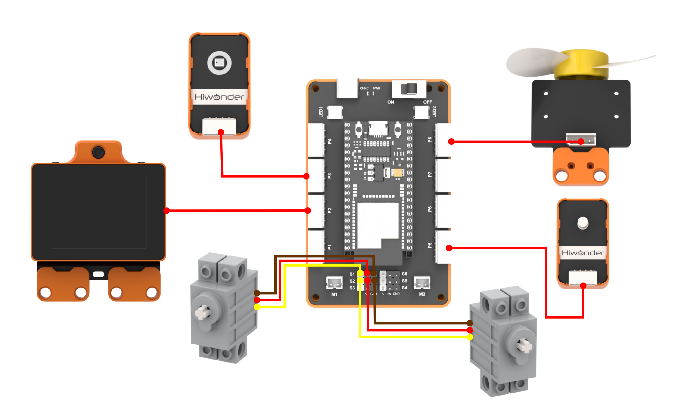

> [!NOTE]
>
> **When conducting a lesson related to the 270° block servo for the first time, remove the gear and its attached building blocks from the 270° servo first, and then upload the following 270° servo reset program to the ESP32 controller. Next, remount the building blocks that were removed, upload the program for this lesson to the ESP32, and wait for the 270° block servo to rotate to its initial position at 135°, leaving the door closed and the clothes rack retracted. This step can be skipped if the servo reset program has been executed previously.**

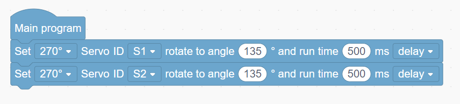

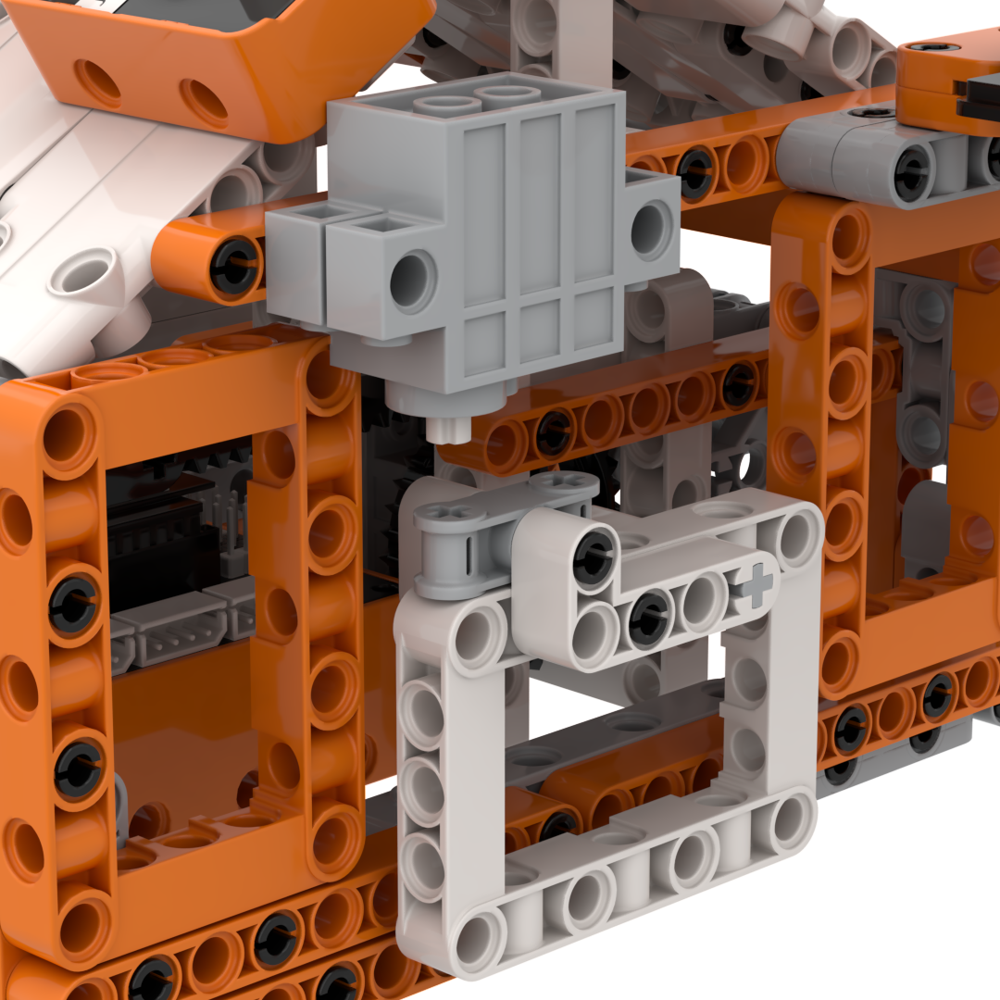

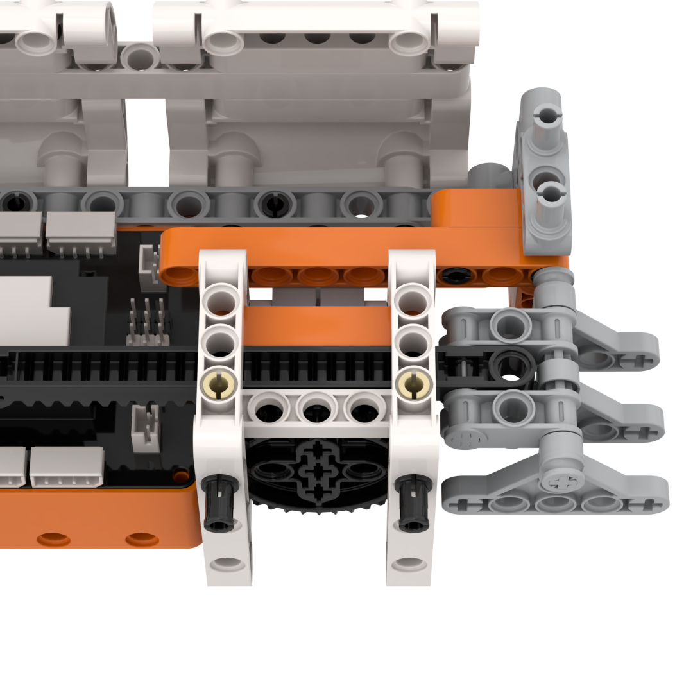

### 3.32.6 Programming

#### (1) Program Concept Diagram

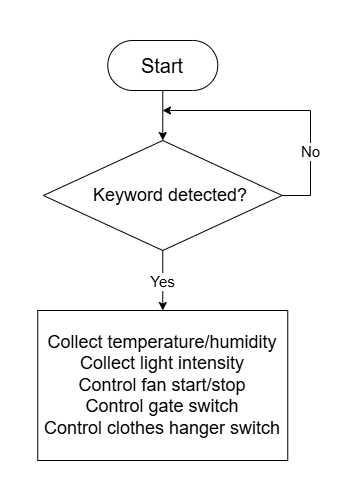

#### (2) Add Extension Libraries

- Select **Sensor** in the **Choose an Extension** interface to add **Light sensor**, **Temperature and humidity sensor**, and **4-channel line follower sensor**.

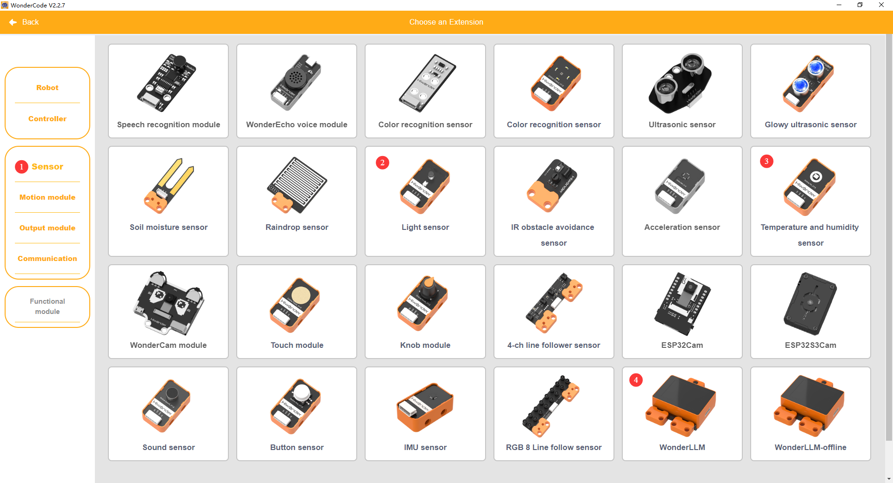

- Select **Output module** in the **Choose an Extension** interface to add **Fan module (Black)**.

#### (3) Core Blocks Analysis

| Block | Category | Function Description |
| :---: | :---: | :--- |
|  |  | Control the 270° servo of a specified port to rotate smoothly to the target angle within a set duration, with an automatic delay to wait for the servo to complete the action. |
|  |  | Send custom text messages to the WonderLLM large model. |
|  |  | Send custom control instructions to the WonderLLM large model. |
|  |  | Configure mcp tool calling parameters, customize the tool name, description, execution command, and return parameters, and set calling blocking and data return rules. |
|  |  | Turn on or off the mcp switch to control whether WonderLLM enables the custom tool calling capability. |
|  |  | Read the result data returned after the execution of the mcp tool is completed. |
|  |  | Control the conversation message output mode, which can send the action end identifier, and turn on or off the printing output of conversation content. |
| 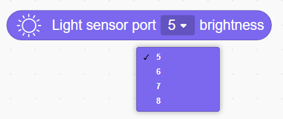 |  | Get the ambient brightness value collected by the light sensor at the corresponding port to determine the brightness level of the environment. |
|  |  | Read the ambient temperature or humidity value collected by the temperature and humidity sensor at the corresponding port. |
|  |  | Perform boolean logical judgments, evaluating input conditions for true/false states or applying negation operations. |
|  |  | Customize the entry or invocation of text content to generate string data for concatenation, judgment, and display. |
|  |  | Determine whether a specified element exists in an array, tuple, or dictionary, returning a boolean result. |
|  |  | Extract the corresponding stored value or text content from a dictionary based on a specified key name. |
|  |  | Create a custom function block and set the function name and incoming parameters of number or text type to encapsulate and reuse a segment of program logic. |
|  |  | Provide number or text parameter inputs for the custom function to be called by the program inside the function. |
|  |  | Call the defined custom function block to execute all program code encapsulated inside that function. |
|  |  | Control the specified fan interface, setting a speed value within the range of 0 to 100 to adjust the fan power. |
|  |  | Insert custom content before the element at the specified index in the list to complete the list element insertion operation. |
|  |  | Generate an empty list container that can hold various types of data, such as numbers and text, for subsequent list operations. |
|  |  | Clear all stored elements in the target list, resetting the list to an empty list. |

#### (4) MCP Parameter Configuration

​	**Tool Name: `self.robot.setHouse`**

​		1. Tool Description: You are the central control of an intelligent house, which can control the opening and closing of doors, the start and stop of fans, and the extension and retraction of automatic clotheslines. Parameters: 1. Door switch, open to 1, close to 0; 2. Fan switch, set to 1 when turned on and 0 when turned off; 3. Automatic clothesline extension and retraction: extend to 1 and retract to 0.

​		2. Command Name: `setHouse`

​		3. **Return Parameters:** `[["setFan","int","0","0","1"],["setDoor","int","0","0","1"],["setHanger","int","0","0","1"]]` **Note that the field name setFan is an integer type, where the first 0 is the default value, the second 0 is the minimum value, and 1 is the maximum value. The field name setDoor is an integer type, where the first 0 is the default value, the second 0 is the minimum value, and 1 is the maximum value. The field name setHanger is an integer type, where the first 0 is the default value, the second 0 is the minimum value, and 1 is the maximum value.**

​		4. Block until completion: Yes

​		5. Return data: No

​		6. Function: This MCP configuration defines a smart house central control tool for the WonderLLM module. It allows WonderLLM to issue 0 to 1 switch commands to control the status of the door, fan, and automatic clothesline respectively. The program blocks during the call to wait for all devices to complete their actions, and no operational data needs to be returned to WonderLLM.

​	**Tool Name: `self.robot.Tem_Hum`**

​		1. Tool Description: Obtain data from temperature and humidity sensors without parameters. After issuing the command, a list will be returned to you, with the first item being temperature and the second item being humidity. The temperature unit is Celsius, and the humidity unit is percentage.

​		2. Command Name: `getTemAndHum`

​		3. Return Parameters: `[[]]`

​		4. Block until completion: Yes

​		5. Return data: Yes

​		6. Function: This MCP configuration defines a temperature and humidity data reading tool for the WonderLLM module. It allows WonderLLM to issue a parameter-free collection command to read the raw data of the temperature and humidity sensor. The program blocks during the call to wait for the sensor data reading to complete, and returns the collection result data containing temperature and humidity to WonderLLM.

​	**Tool Name: `self.robot.Light`**

​		1. Tool Description: You can obtain the value of the light sensor, and after issuing the command, I will return an int type variable to you, which is the light intensity in percentage units. When the light intensity is greater than 70%, it is considered as dawn.

​		2. Command Name: `getLight`

​		3. Return Parameters: `[[]]`

​		4. Block until completion: Yes

​		5. Return data: Yes

​		6. Function: This MCP configuration defines a light intensity reading tool for the WonderLLM module. It allows WonderLLM to issue a parameter-free collection command to read the percentage light intensity value of the light sensor. The program blocks during the call to wait for the light intensity data reading to complete, and returns the light intensity collection result data to WonderLLM.

#### (5) Complete Program

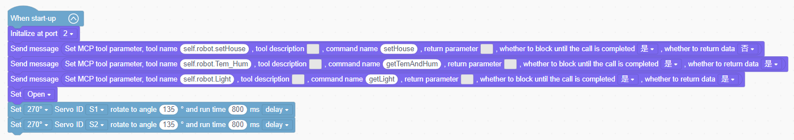

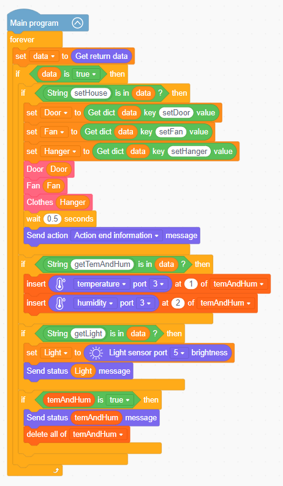

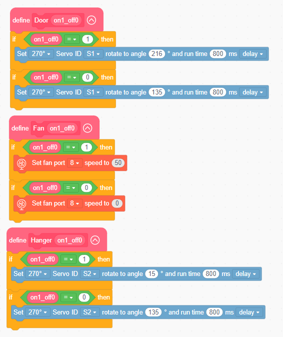

The source files are available for download as a zip archive under [1. Source Code / 02 Program Files for Builds](https://drive.google.com/drive/folders/1guTJsuFCa0f3ZVMcZNNWJ6NruvY7gsUd?usp=sharing).

### 3.32.7 Downloading Programs

### 3.32.8 Project Extensions

When the light sensor detects bright light or the temperature and humidity rise, the fan starts and the clothes rack extends automatically without requiring voice commands. In low-light or low-temperature environments, the rack retracts and the fan stops. Spoken commands can also lock the door, windows, or fan state individually, while the dot matrix display scrolls real-time environmental data.

### 3.32.9 Technical Support and Discussion

Join the forum for sharing questions, ideas, or suggestions, and answers will be provided promptly. Click the hyperlink [Hiwonder Forum](http://forum.hiwonder.com) or enter the URL in a browser: http://forum.hiwonder.com
